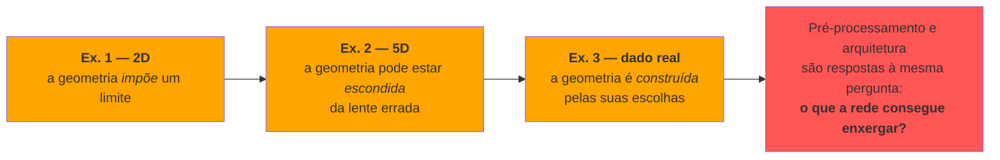

# Exercício 1 — Data

!!! abstract "Status"

    :material-progress-clock: **Em andamento** — prazo **27/ago (qui), 23:59**.

    [Enunciado oficial](https://insper.github.io/ann-dl/2026.2/exercises/data/){:target="_blank"}

## Fio condutor: o que a rede vê

A tese que amarra os três exercícios é que **a dificuldade de um problema de
classificação é uma propriedade geométrica dos dados, mensurável antes de existir
qualquer rede** — e a arquitetura é a resposta a essa geometria, não o contrário. Os
três exercícios atacam isso em três frentes:

| | O que o exercício demonstra |
|---|---|
| **Ex. 1** | Separabilidade é contínua e mensurável. Existe um erro irredutível que vem dos dados — nenhuma arquitetura o remove. |
| **Ex. 2** | Distância entre centros não mede separabilidade. Uma ferramenta linear (PCA) não consegue nem *diagnosticar* estrutura não-linear. |
| **Ex. 3** | Pré-processamento é engenharia de geometria: você decide o que a rede vê. E *data leakage* fabrica uma geometria que não existe no mundo. |

!!! note "Convenções deste relatório"

    - Semente fixa: `rng = np.random.default_rng(42)`, o **mesmo** `rng` do início ao fim.
    - As **Figuras 1 a 6** são as exigidas pelo enunciado. Figuras adicionais são
      numeradas **E1, E2, …** para não quebrar a numeração pedida.
    - Todo número citado no texto vem do código desta mesma página.

---

## Exercise 1 — Point Clouds: Geometry and Spread in 2D

**Objetivo:** transformar "esse problema parece difícil" em um número, e mostrar que
esse número degrada de forma previsível quando a dispersão cresce.

### A — Generate the clouds

??? abstract "📋 Plano — o que esta seção precisa mostrar"

    **Obrigatório**

    - 400 amostras, 4 classes × 100, 2D, com desvio-padrão **por eixo** (não esférico).
    - **Figura 1**: scatter colorido por classe, com o centro de cada nuvem marcado.

    **⭐ Extra de alto retorno**

    - Desenhar as **elipses de covariância** (1σ e 2σ) junto com os centros. A classe 0
      tem `σ = [0.8, 2.5]` — é um charuto vertical apontando para a classe 1. Isso torna
      *visível* por que o par 0–1 será o mais confuso, em vez de deixar só como número.

<!-- TODO: código, Figura 1, descrição -->

### B — More or less spread out

??? abstract "📋 Plano — o que esta seção precisa mostrar"

    **Obrigatório**

    - As **mesmas** 4 classes geradas 4 vezes, com $s \in \{0.5, 1.0, 2.0, 4.0\}$
      multiplicando todos os desvios. As médias nunca mudam.
    - **Figura 2**: 4 subplots com **limites de eixo compartilhados** (senão a comparação
      mente).
    - Tabela dos 6 $r_{ij}$ em $s = 1$, apontando o menor; e o valor desse menor em
      $s = 2$ **deduzido** de $r_{ij} \propto 1/s$, sem gerar dado novo.
    - As 4 **mixing rates** (fração de pontos cujo centro mais próximo não é o da própria
      classe) e a **Figura 3**: mixing rate × $s$.

    **⭐ Extra de alto retorno**

    - Sobrepor as **células de Voronoi** das 4 médias na Figura 1 (ou numa Figura E1).
      A mixing rate é exatamente a fração de pontos do lado errado dessas fronteiras — e
      elas **são retas**. Isso converte a Figura 3 em "erro do melhor classificador linear
      por centroide × dispersão", e dá a resposta do item C com desenho em vez de achismo.
    - Ligar as duas métricas: tabelar o menor $r_{ij}$ de cada $s$ ao lado da mixing rate
      correspondente, mostrando que uma prevê a outra.

<!-- TODO -->

### C — Analysis

??? abstract "📋 Plano — o que esta seção precisa mostrar"

    **Obrigatório**

    - Descrever a sobreposição em $s = 1$: uma única fronteira linear separa tudo? E um
      *conjunto* de fronteiras lineares?
    - Esboçar sobre a Figura 1 as fronteiras que uma rede treinada provavelmente
      aprenderia.
    - Relacionar com o item B: quanto mais espalhadas as nuvens, o que acontece com a
      região onde a rede **necessariamente** erra?

    **⭐ Extra de alto retorno**

    - Contrastar o par 0–1 (o mais apertado) com a classe 3, em $\mu = [15, 4]$, que
      praticamente não se mistura até $s$ alto. A dificuldade é **local**, não uma
      propriedade global do dataset.
    - Nomear o fenômeno: a região de sobreposição é **erro irredutível** (limite de
      Bayes). Aumentar capacidade da rede não a elimina — só overfitta o ruído.

<!-- TODO -->

!!! success "Aprendizado — Exercício 1"

    <!-- TODO: escrever depois de ter os números -->
    O que importa não é a distância absoluta entre as classes, e sim a distância
    **relativa à dispersão**. E parte do erro pertence aos dados, não ao modelo.

---

## Exercise 2 — Non-Linearity in Higher Dimensions

**Objetivo:** mostrar que dispersão não é a única variável — a *estrutura* também conta —
e que ferramentas lineares não conseguem sequer diagnosticar quando ela não é linear.

### A — Dataset I: shifted Gaussians

??? abstract "📋 Plano — o que esta seção precisa mostrar"

    **Obrigatório**

    - 500 + 500 amostras em 5D via `rng.multivariate_normal`, com as médias e as matrizes
      de covariância do enunciado.
    - Comentar que $\Sigma_B$ tem variâncias maiores e correlação **negativa** entre as
      duas primeiras features, enquanto $\Sigma_A$ tem positiva.

<!-- TODO -->

### B — Dataset II: concentric shells

??? abstract "📋 Plano — o que esta seção precisa mostrar"

    **Obrigatório**

    - Direções uniformes na esfera unitária: $v \sim \mathcal{N}(0, I_5)$, depois
      $u = v / \lVert v \rVert$.
    - Raios $\rho \sim \mathcal{N}(2{,}0;\ 0{,}4)$ (classe C) e
      $\rho \sim \mathcal{N}(5{,}0;\ 0{,}4)$ (classe D); ponto final $x = \rho \cdot u$.

    !!! warning "Ambiguidade a declarar"

        O enunciado escreve $\mathcal{N}(2.0,\ 0.4)$ sem dizer se `0.4` é desvio-padrão ou
        variância. Adotar **desvio-padrão** (é o que `rng.normal(2.0, 0.4)` faz) e
        **declarar a suposição em uma linha** no relatório.

<!-- TODO -->

### C — Visualize and compare

??? abstract "📋 Plano — o que esta seção precisa mostrar"

    **Obrigatório**

    - **Figura 4**: PCA para 2D nos dois datasets, scatters lado a lado.
    - Variância explicada de PC1 + PC2 em cada caso, e em qual a projeção preserva melhor
      a informação relevante para classificação.
    - Em **5D**: distância entre os centros das classes nos dois datasets.
    - **Figura 5**: histograma do raio $\lVert x \rVert$, as duas classes sobrepostas no
      mesmo eixo.

    **⭐ Extra de alto retorno — o ponto alto do exercício**

    - **Figura E2 — projeções em direções aleatórias.** Sortear 3 ou 4 vetores $w$ e
      plotar o histograma 1D de $w \cdot x$ para cada dataset. No Dataset I as classes se
      separam; no Dataset II elas se sobrepõem *perfeitamente*, para **qualquer** $w$.
      Isso **demonstra** a impossibilidade do hiperplano em vez de argumentar — e usar
      várias direções mostra que não foi sorte.
    - **Figura E3 — a feature que resolve.** Histograma de $\lVert x \rVert^2$ com um
      limiar separando as classes. O mesmo dado: inseparável em 5D, trivial em 1D, só
      dependendo da coordenada. É a definição visual do que uma camada escondida faz.
    - Interpretar a variância explicada como **diagnóstico**: o Dataset II é isotrópico,
      então cada PC carrega ~20% e PC1+PC2 ≈ 40%. Variância baixa e uniforme entre as
      componentes = "não existe direção privilegiada" = sinal de que a estrutura não é
      linear.
    - Observar que PCA maximiza **variância**, não separabilidade — a direção que melhor
      separa pode não ser a PC1.

<!-- TODO -->

### D — Analysis

??? abstract "📋 Plano — o que esta seção precisa mostrar"

    **Obrigatório** — as três perguntas do enunciado:

    1. Centros quase coincidentes + histogramas de raio bem separados: o que essa
       combinação diz sobre separar com um hiperplano?
    2. Por que nenhuma quantidade de dados resolve o Dataset II com fronteira linear?
    3. PCA é linear — uma projeção 2D bagunçada **prova** inseparabilidade? Justificar com
       os próprios resultados e **escrever a função** das entradas que separa o Dataset II.

    **O argumento central a construir**

    Por simetria radial, para *qualquer* direção $w$ a projeção $w \cdot x$ das duas
    classes tem a mesma distribuição simétrica em torno de zero. Logo nenhum hiperplano
    separa — e isso não é falta de dados, é a geometria. Mas
    $\lVert x \rVert^2 = \sum_i x_i^2$, uma feature **quadrática**, separa trivialmente.

    **⭐ Extra**

    - Notar que no Dataset I as duas classes têm covariâncias **diferentes**, então a
      fronteira ótima já é quadrática, não linear — mesmo no caso "fácil".

<!-- TODO -->

!!! success "Aprendizado — Exercício 2"

    <!-- TODO -->
    A não-linearidade não está no modelo — está na escolha da representação. Camadas
    escondidas com ativação não-linear existem para descobrir sozinhas a coordenada certa,
    do mesmo jeito que $\lVert x \rVert^2$ resolve o Dataset II.

---

## Exercise 3 — Preparing Real-World Data for a Neural Network

**Objetivo:** sair do sintético e mostrar que as suas decisões de pré-processamento
mudam a geometria que a rede recebe — e que a integridade do split é o que separa um
número confiável de um número bonito.

### A — Get to know the data

??? abstract "📋 Plano — o que esta seção precisa mostrar"

    **Obrigatório**

    - Baixar o [Spaceship Titanic](https://www.kaggle.com/competitions/spaceship-titanic/data){:target="_blank"}
      (`train.csv`, o único arquivo rotulado).
    - O que representa a coluna `Transported` e o **balanço de classes**.
    - Features **numéricas** × **categóricas**.
    - Tabela de **missing values** por coluna, em contagem absoluta e percentual.
    - Média, mediana e máximo das 5 colunas de gasto — e a leitura: média ≫ mediana
      significa cauda pesada à direita.

    **⭐ Extra de alto retorno**

    - Verificar que os `NaN` das colunas de gasto **não são aleatórios**: eles
      correlacionam com `CryoSleep` (quem está em criogenia não consome nada). Se isso se
      confirmar, imputar `0` em vez de mediana deixa de ser convenção e vira decisão
      **justificada por evidência** — exatamente o que o critério de correção premia.
    - Comentar que o balanço ~50/50 dispensa tratamento de desbalanceamento. É uma
      decisão informada, não uma omissão.

<!-- TODO -->

### B — Split before you transform

??? abstract "📋 Plano — o que esta seção precisa mostrar"

    **Obrigatório**

    - Split 80/20 **estratificado** pelo alvo, com semente fixa.
    - Duas ou três frases explicando por que o split vem **antes** de imputação e scaling.

    **⭐ Extra de alto retorno**

    - **Demonstrar o vazamento com número**: calcular a mediana (ou a média) de uma coluna
      no dataset inteiro e só no treino, e mostrar que diferem. Fecha o item com evidência
      em vez de discurso — e é justamente o item que carrega a dedução de **−1,0**.
    - Blindagem estrutural: montar `ColumnTransformer` + `Pipeline` e chamar `.fit()`
      **só** com `X_train`. Assim o vazamento fica impossível por construção, e isso vira
      um argumento forte no relatório.

<!-- TODO -->

### C — Preprocess

??? abstract "📋 Plano — o que esta seção precisa mostrar"

    **Obrigatório** — tudo fitado no treino e apenas *aplicado* no teste:

    | Etapa | O que fazer |
    |---|---|
    | Missing | Estratégia por tipo de coluna, cada escolha justificada |
    | Encoding | One-hot em `HomePlanet`, `CryoSleep`, `Destination`, `VIP` — e explicar como o código lida com categoria que só aparece no teste |
    | Feature eng. | Criar `TotalSpend` (soma dos 5 gastos); dropar `Cabin`, `Name`, `PassengerId` |
    | Caudas | $\log(1 + x)$ nas colunas de gasto, com histograma de uma delas antes/depois, e **por que** isso ajuda uma rede com `tanh` |
    | Escala | Padronização **ou** normalização para $[-1, 1]$ — escolher uma, justificar, reportar min/max |

    A ordem importa: `TotalSpend` → `log1p` → scaling. Logaritmo depois de padronizar não
    faz sentido, porque já haveria valores negativos.

    **⭐ Extra de alto retorno**

    - **Quantificar a saturação do `tanh`.** Sem `log1p`, padronizar e contar que
      porcentagem das amostras cai em $|z| > 2$, onde $\tanh'(z) \approx 0$ e o gradiente
      morre; depois repetir com `log1p`. "O log ajuda" vira um número, não uma afirmação.
    - Sobre a categoria não vista: em vez de só citar `handle_unknown='ignore'`,
      **demonstrar** — verificar se existe alguma categoria do teste ausente no treino, ou
      forçar um caso sintético e mostrar que o pipeline não quebra.

<!-- TODO -->

### D — Verify and visualize

??? abstract "📋 Plano — o que esta seção precisa mostrar"

    **Obrigatório**

    - **Figura 6**: histograma de uma feature de cauda pesada (`FoodCourt`, por exemplo)
      **antes e depois** do pré-processamento, com eixos rotulados.
    - Checagens explícitas: nenhum `NaN` restante, `shape` final da matriz de features,
      faixa de valores compatível com `tanh`.
    - Um parágrafo: qual decisão de pré-processamento mais afetaria o treino, e por quê.

    **⭐ Extra**

    - Fazer a Figura 6 em três painéis — bruto → `log1p` → escalado — e marcar a faixa
      onde o `tanh` ainda tem gradiente útil. Cada etapa fica com efeito visível.

<!-- TODO -->

!!! success "Aprendizado — Exercício 3"

    <!-- TODO -->
    Pré-processamento não é burocracia antes do modelo: é a etapa em que você escolhe a
    geometria que a rede vai enxergar. E a disciplina do split é o que faz o número
    reportado significar alguma coisa.

---

## O que ficou

<!-- TODO: escrever no fim, amarrando os três -->

Os três exercícios são o mesmo argumento visto de três ângulos: a geometria dos dados
**impõe** um limite (Ex. 1), pode estar **escondida** da ferramenta errada (Ex. 2) e é
**construída** pelas decisões de preparação (Ex. 3).

Isso prepara diretamente as próximas entregas: o Ex. 1 delimita o que um
[Perceptron](../perceptron/index.md) consegue fazer, o Ex. 2 justifica por que existem
camadas escondidas em um [MLP](../mlp/index.md), e o Ex. 3 entrega o pipeline de dados
reaproveitado no resto do semestre.

---

## Results summary

!!! note "Esta é a última seção do relatório, por exigência do enunciado"

    A tabela não substitui análise nenhuma — é um índice dos números já calculados acima,
    reunidos em um lugar só.

| # | Item | Valor |
|---|---|---|
| 1 | Mixing rate em $s = 0.5$ | |
| 2 | Mixing rate em $s = 1.0$ | |
| 3 | Mixing rate em $s = 2.0$ | |
| 4 | Mixing rate em $s = 4.0$ | |
| 5 | Menor $r_{ij}$ em $s = 1.0$, e qual par | |
| 6 | Distância entre centros — Dataset I | |
| 7 | Distância entre centros — Dataset II | |
| 8 | Variância explicada PC1 + PC2 — Dataset I | |
| 9 | Variância explicada PC1 + PC2 — Dataset II | |
| 10 | Proporção da classe positiva em `Transported` | |
| 11 | Média e mediana de `FoodCourt` no treino, antes de transformar | |
| 12 | `shape` final da matriz de features de treino | |
| 13 | Mínimo e máximo de treino e teste após o scaling | |
