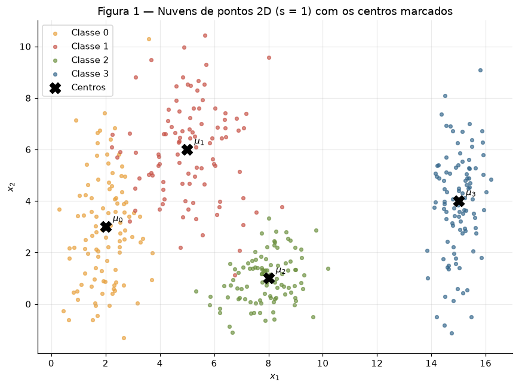
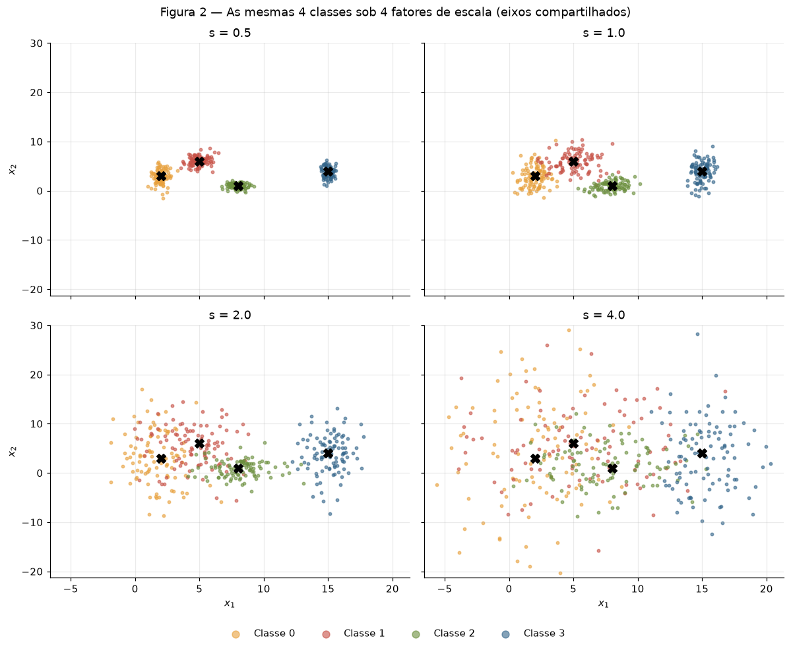
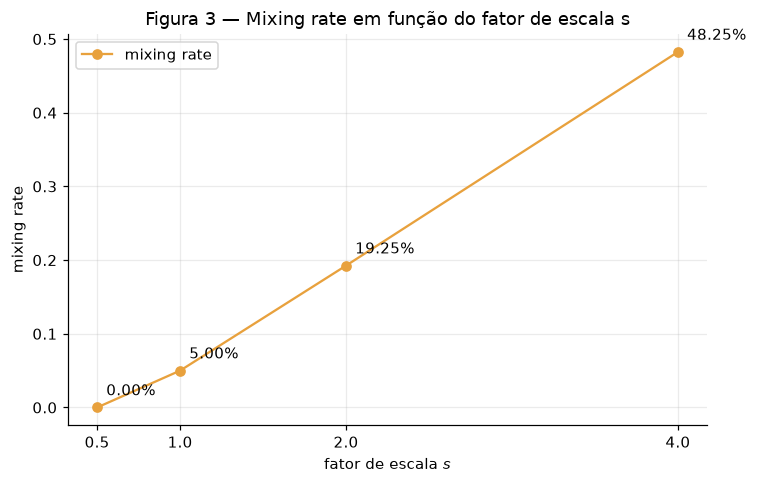
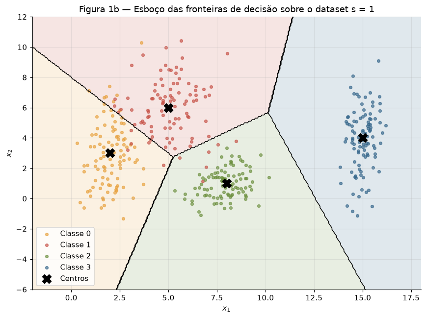
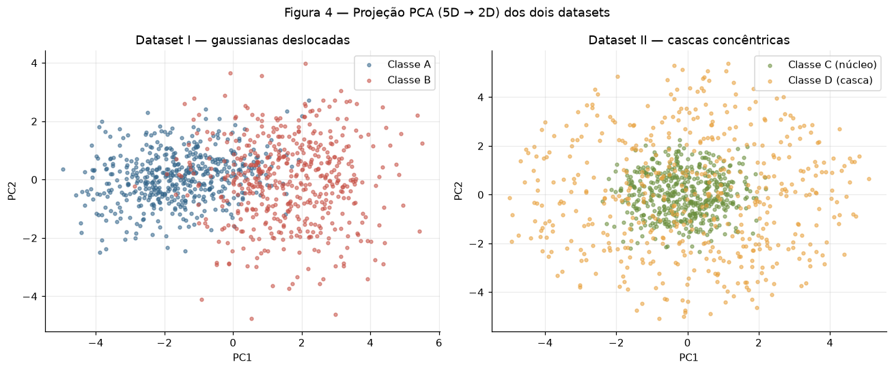
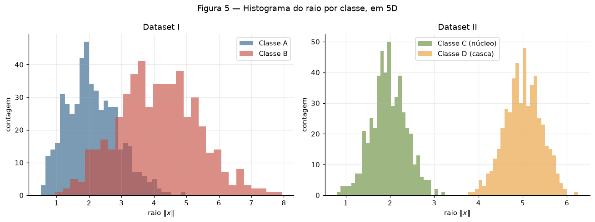
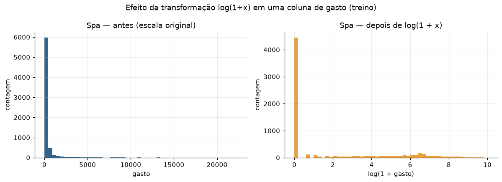
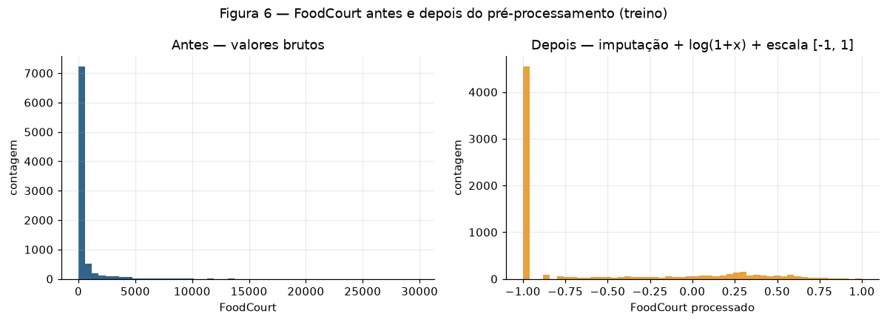

# Exercício — Data

!!! abstract "Sobre esta entrega"

    Atividade individual de geração, manipulação e preparação de dados para redes
    neurais ([enunciado](https://insper.github.io/ann-dl/2026.2/exercises/data/){:target="_blank"}).
    O fio condutor é a **dispersão**: quanto uma nuvem de pontos se espalha e como isso
    muda a dificuldade do problema. Nenhum modelo é treinado — todas as medidas são
    geométricas ou estatísticas.

    **Código:** os scripts que geram cada número e cada figura desta página estão em
    [`code/`](https://github.com/Lagoass/ann-dl/tree/main/docs/exercises/data/code){:target="_blank"}
    e são incluídos ao fim de cada exercício. **Figuras** em `figures/`, commitadas.
    As versões em notebook, com as saídas executadas, ficam de anexo:
    [Ex. 1](ex1_point_clouds.ipynb) · [Ex. 2](ex2_nonlinearity.ipynb) · [Ex. 3](ex3_preprocessing.ipynb).

!!! note "Reprodutibilidade e a regra do `rng`"

    Cada exercício usa `rng = np.random.default_rng(42)` e consome o gerador na ordem
    exata em que o relatório apresenta os resultados; re-executar qualquer script
    reproduz todos os números daqui. Dois pontos que declaro de antemão: cada script
    re-instancia o `rng` com a mesma seed (é o que torna cada exercício reproduzível
    isoladamente), e no split do Ex. 3 uso `random_state=42` inteiro porque o
    `train_test_split` do scikit-learn não aceita um `Generator` do NumPy.

    ``` shell
    git clone https://github.com/Lagoass/ann-dl.git && cd ann-dl
    pip install -r requirements.txt
    python docs/exercises/data/code/ex1_point_clouds.py
    python docs/exercises/data/code/ex2_nonlinearity.py
    python docs/exercises/data/code/ex3_preprocessing.py
    ```

## Exercise 1 — Point Clouds: Geometry and Spread in 2D

A ideia: gerar nuvens 2D e **medir** o quanto elas se misturam antes de pensar em
qualquer rede — com duas réguas, a razão de separação $r_{ij}$ e a *mixing rate*.

### A — Generate the clouds

400 amostras, 4 classes × 100, cada eixo com média e desvio próprios (nada de gaussiana
esférica): $\mu_0=[2,3]$, $\mu_1=[5,6]$, $\mu_2=[8,1]$, $\mu_3=[15,4]$, com
$\sigma_0=[0.8,2.5]$, $\sigma_1=[1.2,1.9]$, $\sigma_2=[0.9,0.9]$, $\sigma_3=[0.5,2.0]$.



O que me chama atenção de cara: a classe 0 ($\sigma = [0.8, 2.5]$) é um charuto
vertical apontando direto para a classe 1, enquanto a classe 2 é quase redonda e a
classe 3, lá em $\mu = [15, 4]$, vive isolada das outras.

### B — More or less spread out

As mesmas 4 classes, geradas 4 vezes, multiplicando **todos** os desvios por
$s \in \{0.5, 1.0, 2.0, 4.0\}$ — as médias não mudam, só o espalhamento. Para $s = 1$
reutilizo o dataset do item A (mesma amostra).



**Razão de separação em $s = 1$** — com
$r_{ij} = \dfrac{\lVert \mu_i - \mu_j \rVert}{\bar{\sigma}_i + \bar{\sigma}_j}$ e
$\bar{\sigma}_k$ a média dos desvios da classe $k$, os 6 pares dão:

| par | $\lVert \mu_i - \mu_j \rVert$ | $\bar{\sigma}_i + \bar{\sigma}_j$ | $r_{ij}$ |
|---|---|---|---|
| **(0, 1)** | 4.243 | 3.20 | **1.326** ← menor |
| (0, 2) | 6.325 | 2.55 | 2.480 |
| (0, 3) | 13.038 | 2.90 | 4.496 |
| (1, 2) | 5.831 | 2.45 | 2.380 |
| (1, 3) | 10.198 | 2.80 | 3.642 |
| (2, 3) | 7.616 | 2.15 | 3.542 |

O par mais apertado é o **(0, 1)**, com $r_{01} = 1.326$ — todos os outros têm
$r_{ij} \geq 2.38$. E aqui está o pulo do gato: como as médias não mudam com $s$, vale
$r_{ij} \propto 1/s$. Então em $s = 2$ o menor valor vira $1.326 / 2 = \mathbf{0.663}$,
sem eu precisar gerar um ponto sequer.

**Mixing rate** — fração de pontos cujo centro mais próximo (entre as 4 médias
teóricas) **não** é o da própria classe; é só comparar distâncias, nada é treinado:
**0.00%** em $s{=}0.5$ (0/400), **5.00%** em $s{=}1$ (20/400), **19.25%** em $s{=}2$
(77/400) e **48.25%** em $s{=}4$ (193/400).



**A partir de que escala as retas param de funcionar?** A partir de $s = 2$. Em $s = 1$
a mistura é de 5% e mora quase toda no par (0, 1) — um conjunto de retas ainda dá conta
do resto. Em $s = 2$ a mistura salta para 19.25% e o menor $r_{ij}$ cai para **0.663**:
a distância entre os centros 0 e 1 fica *menor* que a soma das dispersões médias, ou
seja, as nuvens se atravessam e não existe arranjo de retas que escape de uma fração
grande de erro. Em $s = 4$ ($r_{01} = 0.33$), quase metade dos pontos já está mais
perto de um centro alheio.

### C — Analysis

Meu esboço das fronteiras, desenhado sobre os dados da Figura 1 (numerei como
**Figura 1b** para não bagunçar a numeração pedida): divido o plano pela regra do
centro mais próximo — fronteiras retas, a aproximação do que uma rede pequena
aprenderia.



**Sobreposição em $s = 1$.** A única briga de verdade é entre as classes 0 e 1
($r_{01} = 1.326$): a cauda vertical da 0 invade a nuvem da 1. Os outros pares têm
$r_{ij} \geq 2.38$ e mal se encostam.

**Uma única fronteira linear resolve?** Não — uma reta corta o plano em só duas
regiões, e eu tenho 4 classes. **Um conjunto de retas?** Quase: a partição da Figura 1b
acerta 95% dos pontos; os 5% que sobram estão na zona 0–1, onde as distribuições se
sobrepõem de fato.

**O esboço.** As fronteiras da Figura 1b são o que eu espero de uma rede treinada:
cortes aproximadamente retos entre centros vizinhos. Com mais capacidade ela curvaria o
corte 0–1 (a classe 0 é bem mais esticada em $x_2$ que a 1), mas nenhuma fronteira
elimina a região onde as duas densidades se misturam.

**Ligando com o item B.** Quanto maior a dispersão, maior a área onde as densidades das
classes se sobrepõem — e ali qualquer classificador erra, por melhor que seja. Esse é o
**erro irredutível**, que pertence aos dados: a mixing rate de 5% → 19% → 48% é
exatamente essa região crescendo.

> **O que eu tiro daqui:** a dificuldade de classificar é geométrica e dá para medir
> antes de treinar qualquer coisa. O que importa é a distância entre centros
> **relativa à dispersão** ($r_{ij}$), não a absoluta — e quando $r_{ij}$ cai abaixo de
> ~1, as nuvens se atravessam e nasce um erro que nenhuma arquitetura remove.

??? example "Código — `ex1_point_clouds.py`"

    ``` { .python .copy linenums="1" title="docs/exercises/data/code/ex1_point_clouds.py" }
    --8<-- "docs/exercises/data/code/ex1_point_clouds.py"
    ```

## Exercise 2 — Non-Linearity in Higher Dimensions

Dois datasets 5D com a mesma dimensionalidade e estruturas bem diferentes. A pergunta
de fundo: o que medidas *lineares* conseguem enxergar em cada um?

### A — Dataset I: shifted Gaussians

500 amostras por classe via `rng.multivariate_normal`, com $\mu_A = \mathbf{0}$,
$\mu_B = [1.5, 1.5, 1.5, 1.5, 1.5]$ e as matrizes $\Sigma_A$ e $\Sigma_B$ do enunciado.
As dispersões são diferentes de propósito: $\Sigma_B$ tem variâncias maiores (1.5
contra 1.0) e correlação **negativa** entre as duas primeiras features (−0.7), enquanto
em $\Sigma_A$ ela é positiva (+0.8).

### B — Dataset II: concentric shells

Sorteio uma direção uniforme na esfera unitária de $\mathbb{R}^5$
($v \sim \mathcal{N}(0, I_5)$, $u = v/\lVert v \rVert$) e multiplico por um raio
gaussiano: $x = \rho \cdot u$, com $\rho \sim \mathcal{N}(2.0,\ 0.4)$ no núcleo
(classe C) e $\rho \sim \mathcal{N}(5.0,\ 0.4)$ na casca (classe D). O `0.4` do
enunciado eu tratei como **desvio-padrão** do raio.

### C — Visualize and compare





**Os números.** Variância explicada por PC1+PC2: **0.6597** no Dataset I (PC1 = 0.5004,
PC2 = 0.1593) contra **0.4291** no Dataset II (PC1 = 0.2159, PC2 = 0.2132). Distância
entre centros em 5D: **3.2282** no Dataset I (o teórico é $1.5\sqrt{5} = 3.354$) contra
**0.2662** no Dataset II.

A projeção 2D preserva melhor a informação de classe no **Dataset I**: o deslocamento
entre as médias cria uma direção privilegiada de variância, e o PCA a captura em PC1 —
na Figura 4 dá para ver dois blocos com sobreposição parcial. No Dataset II a variância
é praticamente a mesma em toda direção (PC1 ≈ PC2 ≈ 21.5%, o esperado para dados
isotrópicos em 5D) e a projeção vira um borrão com as classes misturadas — enquanto a
Figura 5 mostra que, em 5D, os raios são perfeitamente separados (C: 1.97 ± 0.40, máx
3.25; D: 5.00 ± 0.41, mín 3.75). Os histogramas nem se encostam.

### D — Analysis

**1. Centros coincidentes × raios separados.** A distância entre os centros do
Dataset II é 0.2662 (≈ 0), mas os histogramas de raio têm um vão entre 3.25 e 3.75. Um
hiperplano separa por *posição ao longo de uma direção* — e as duas classes ocupam as
mesmas posições em todas as direções, diferindo só na *distância à origem*. Conclusão:
hiperplano nenhum separa essas classes; a informação discriminante é radial, não
direcional.

**2. Por que mais dados não salvam.** Por simetria esférica, a projeção de cada classe
sobre **qualquer** direção $w$ é simétrica em torno de zero, e as projeções das duas
classes se sobrepõem fortemente. Coletar mais dados só estima melhor essas mesmas
distribuições sobrepostas — o erro de qualquer fronteira linear continua alto. A
limitação é da *família de fronteiras*, não da amostra.

**3. Projeção PCA embolada prova inseparabilidade?** Não — e o Dataset II é o
contraexemplo perfeito. O PCA é uma transformação **linear**: a projeção 2D é um borrão
(PC1+PC2 = 42.9%), mas basta uma função não-linear simples das entradas para separar
tudo:

$$ f(x) = \lVert x \rVert^2 = \sum_{i=1}^{5} x_i^2, \qquad
\text{classe C se } f(x) < 3.5^2 = 12.25 $$

Conferi essa regra fixa (nada é treinado): ela acerta **100%** das 1000 amostras. O
mesmo dado que parece impossível sob qualquer lente linear fica trivial depois de uma
única transformação quadrática — que é exatamente o tipo de feature que as camadas
escondidas de uma rede aprendem sozinhas.

> **O que eu tiro daqui:** distância entre centros não mede separabilidade, e
> ferramenta linear (PCA, hiperplano) não consegue nem *diagnosticar* estrutura
> não-linear. A separabilidade do Dataset II estava na representação
> ($\lVert x \rVert^2$), não nos dados — e é isso que justifica camadas escondidas com
> ativação não-linear.

??? example "Código — `ex2_nonlinearity.py`"

    ``` { .python .copy linenums="1" title="docs/exercises/data/code/ex2_nonlinearity.py" }
    --8<-- "docs/exercises/data/code/ex2_nonlinearity.py"
    ```

## Exercise 3 — Preparing Real-World Data for a Neural Network

Pré-processamento do [Spaceship Titanic](https://www.kaggle.com/competitions/spaceship-titanic){:target="_blank"}
(`train.csv`, o único arquivo rotulado — versionado em `spaceship-titanic/`) para uma
rede com `tanh` nas camadas escondidas. A regra que rege tudo: **toda estatística é
calculada só no treino** — o teste apenas recebe as transformações.

### A — Get to know the data

Cada linha é um passageiro da nave; a coluna-alvo `Transported` diz se ele foi
transportado para outra dimensão na colisão com a anomalia espaço-temporal — ou seja,
**classificação binária**. **Balanço de classes:** 4378 `True` × 4315 `False` =
**50.36%** de positivos nas 8693 amostras. Praticamente empatado, o que me poupa de
qualquer malabarismo com desbalanceamento.

**Features** (fora os identificadores `PassengerId`, `Name` e `Cabin`, que descarto):
numéricas — `Age`, `RoomService`, `FoodCourt`, `ShoppingMall`, `Spa`, `VRDeck`;
categóricas — `HomePlanet`, `CryoSleep`, `Destination`, `VIP`.

**Valores faltantes por coluna** (contagem e %):

| Coluna | Faltantes | % | Coluna | Faltantes | % |
|---|---|---|---|---|---|
| `CryoSleep` | 217 | 2.50 | `Spa` | 183 | 2.11 |
| `ShoppingMall` | 208 | 2.39 | `FoodCourt` | 183 | 2.11 |
| `VIP` | 203 | 2.34 | `Destination` | 182 | 2.09 |
| `HomePlanet` | 201 | 2.31 | `RoomService` | 181 | 2.08 |
| `Name` | 200 | 2.30 | `Age` | 179 | 2.06 |
| `Cabin` | 199 | 2.29 | `PassengerId` | 0 | 0.00 |
| `VRDeck` | 188 | 2.16 | `Transported` | 0 | 0.00 |

Todas as colunas de entrada têm entre **179 e 217** buracos (**2.06% a 2.50%**).

**Colunas de gasto** — média, mediana e máximo:

| | `RoomService` | `FoodCourt` | `ShoppingMall` | `Spa` | `VRDeck` |
|---|---|---|---|---|---|
| média | 224.69 | 458.08 | 173.73 | 311.14 | 304.85 |
| mediana | 0.00 | 0.00 | 0.00 | 0.00 | 0.00 |
| máximo | 14327 | 29813 | 23492 | 22408 | 24133 |

**Média × mediana:** a mediana das cinco é **0** — mais da metade dos passageiros não
gastou um centavo — enquanto as médias vão de 173.73 a 458.08 e os máximos chegam a
29813. Média muito acima da mediana é a assinatura clássica de **cauda pesada à
direita**: uma minoria gastadora puxa a média para cima e domina a dispersão.

### B — Split before you transform

Split **80/20 estratificado** pelo alvo com seed fixa (`random_state=42`): **6954** no
treino, **1739** no teste, os dois com 50.4% de positivos (0.5036 / 0.5037).

**Por que separar antes?** O teste existe para simular dado que o modelo nunca viu. Se
eu calculasse qualquer estatística (mediana, mínimo/máximo, categorias) com o dataset
inteiro, informação do teste vazaria para dentro do pré-processamento e a avaliação
viraria maquiagem (*data leakage*). Então daqui para baixo: estatística sai **só do
treino**, e o teste apenas recebe a transformação pronta.

### C — Preprocess

**Valores faltantes.** Mediana nas numéricas, moda nas categóricas — ambas calculadas
só no treino: `Age = 27`, gasto `0` (o valor típico das caudas pesadas do item A; a
média seria puxada pelos gastões), e `Earth` / `False` / `TRAPPIST-1e` / `False` nas
categóricas. A moda preenche com a categoria mais comum sem inventar níveis novos.

**Feature engineering.** Crio `TotalSpend`, a soma das cinco colunas de gasto —
*depois* da imputação, senão a soma vira `NaN` — e descarto `Cabin`, `Name` e
`PassengerId`.

**Caudas pesadas.** `log(1 + x)` nos gastos e no `TotalSpend`:



**Por que o log importa para o `tanh`:** sem ele, os máximos na casa das dezenas de
milhares mandam na escala — depois de normalizar, quase todo mundo fica espremido num
intervalinho perto de $-1$ e os extremos caem onde o `tanh` satura (derivada ≈ 0). Ali
o gradiente morre de vez. O `log(1+x)` comprime a cauda, espalha a massa de dados pela
faixa útil da ativação e ainda mantém `0 → 0`.

**Categóricas.** One-hot (`HomePlanet`, `CryoSleep`, `Destination`, `VIP`) ajustado só
no treino. **E se aparecer uma categoria só no teste?** Com `handle_unknown="ignore"`,
um nível que o treino nunca viu vira um **vetor todo-zeros** naquele grupo de colunas —
o pipeline não quebra e o teste não cria coluna nova. (Aqui as categorias coincidem
entre treino e teste, mas a garantia vale em geral.)

**Escala.** Normalização para $[-1, 1]$, a faixa nativa do `tanh` — feita na mão de
propósito: min e max vêm **do treino**, a fórmula é $2(x - \min)/(\max - \min) - 1$. No
treino o resultado é exatamente $[-1.0000,\ 1.0000]$. No teste o máximo chega a
**1.1383** (`ShoppingMall` e `VRDeck` têm valores acima do máximo visto no treino) — e
isso não é bug: é a consequência esperada de ajustar a escala só no treino, ou seja,
**evidência de que não houve vazamento**. O leve estouro não incomoda o `tanh`, que
aceita qualquer real.

### D — Verify and visualize



**Checagens explícitas:** zero `NaN` restante (treino e teste); matriz final de treino
com shape **(6954, 17)** — 7 numéricas, contando o `TotalSpend`, + 10 colunas one-hot;
valores em $[-1.0000, 1.0000]$ no treino e $[-1.0000, 1.1383]$ no teste — tudo em casa
para o `tanh`. Média e mediana de `FoodCourt` no treino, antes de transformar:
**452.61** / **0.00**.

**Reflexão.** Se eu tivesse que apostar em qual decisão mais afeta o treinamento, é o
**`log(1+x)` nos gastos**. Sem ele, a normalização seria ditada pelos máximos extremos
(até 29813) e mais de metade dos dados ficaria espremida num intervalo minúsculo colado
em $-1$ — justamente a região onde o `tanh` satura e o gradiente some. As outras
escolhas (mediana × média, one-hot, escala) mexem pouco na geometria; o log muda o que
a rede consegue enxergar.

> **O que eu tiro daqui:** pré-processar é decidir a geometria que a rede recebe — no
> caso do `tanh`, caudas comprimidas e entradas em $[-1, 1]$. E ajustar tudo só no
> treino é o que mantém o número confiável: o teste estourar de leve a faixa da escala
> é o comportamento *esperado* de um pipeline sem vazamento.

??? example "Código — `ex3_preprocessing.py`"

    ``` { .python .copy linenums="1" title="docs/exercises/data/code/ex3_preprocessing.py" }
    --8<-- "docs/exercises/data/code/ex3_preprocessing.py"
    ```

## Results summary

| # | Item | Valor |
|---|---|---|
| 1 | Mixing rate em $s = 0.5$ | **0.00%** (0/400) |
| 2 | Mixing rate em $s = 1.0$ | **5.00%** (20/400) |
| 3 | Mixing rate em $s = 2.0$ | **19.25%** (77/400) |
| 4 | Mixing rate em $s = 4.0$ | **48.25%** (193/400) |
| 5 | Menor $r_{ij}$ em $s = 1.0$, e qual par | **1.326**, par **(0, 1)** |
| 6 | Distância entre centros — Dataset I | **3.2282** |
| 7 | Distância entre centros — Dataset II | **0.2662** |
| 8 | Variância explicada PC1 + PC2 — Dataset I | **0.6597** (0.5004 + 0.1593) |
| 9 | Variância explicada PC1 + PC2 — Dataset II | **0.4291** (0.2159 + 0.2132) |
| 10 | Proporção da classe positiva em `Transported` | **50.36%** (4378/8693) |
| 11 | Média e mediana de `FoodCourt` no treino, antes de transformar | **452.61** / **0.00** |
| 12 | `shape` final da matriz de features de treino | **(6954, 17)** |
| 13 | Mínimo e máximo de treino e teste após o scaling | treino **[−1.0000, 1.0000]** · teste **[−1.0000, 1.1383]** |
