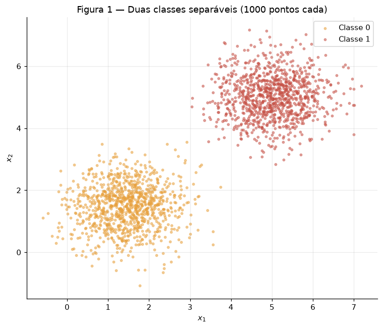
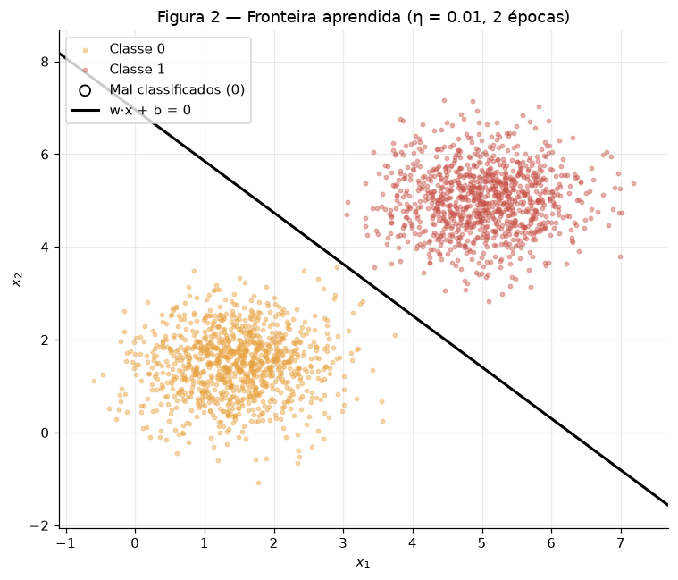
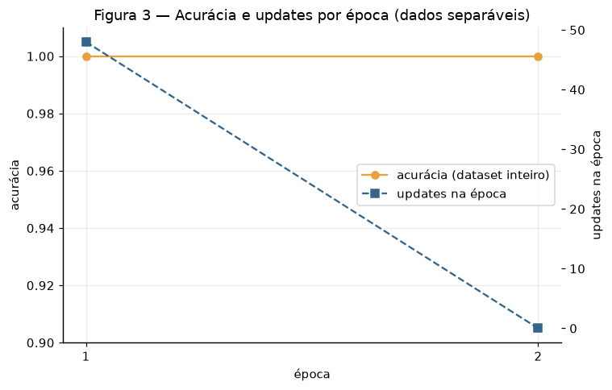
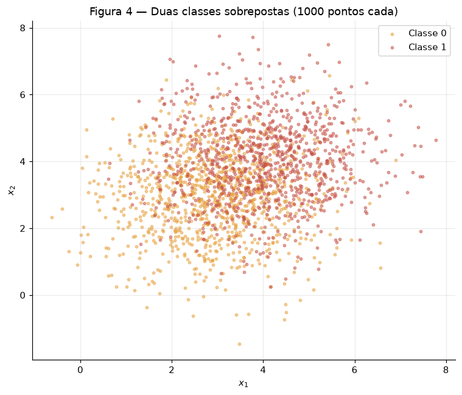
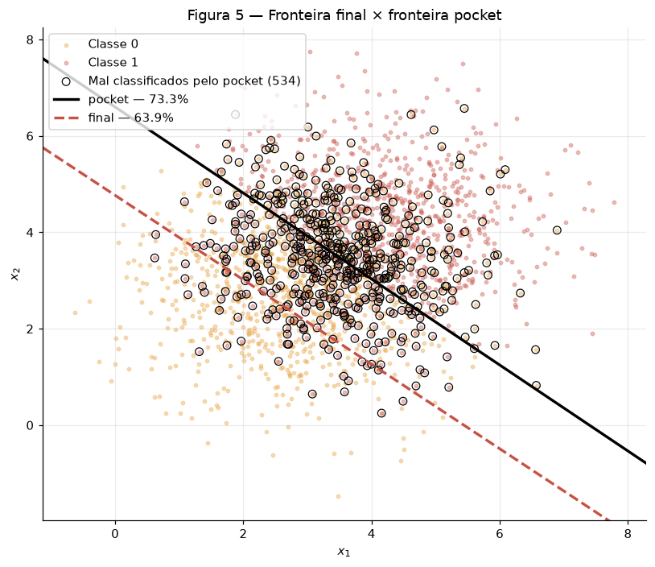
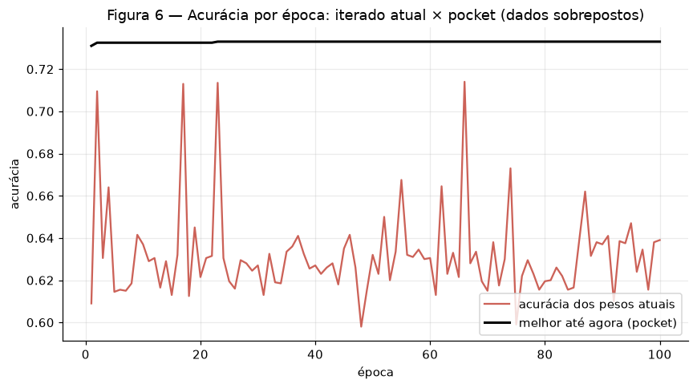

# Exercício — Perceptron

!!! abstract "Sobre esta entrega"

    Atividade individual sobre perceptrons e seus limites
    ([enunciado](https://insper.github.io/ann-dl/2026.2/exercises/perceptron/){:target="_blank"}).
    O fio condutor é a **separabilidade**: o mesmo perceptron treinado em dois datasets —
    um que ele resolve, outro que não — e o interessante é *como* ele falha no segundo.

    **Código** em [`code/`](https://github.com/Lagoass/ann-dl/tree/main/docs/exercises/perceptron/code){:target="_blank"},
    incluído nas seções: `perceptron.py` (o modelo, escrito uma vez) e um script por
    exercício. **Figuras** em `figures/`, commitadas. O passo a passo do meu raciocínio
    está em [Raciocínio — Perceptron](../../raciocinio/perceptron.md).

!!! note "Uso de IA"

    Usei Claude (Claude Code) como par de programação, seguindo um plano por etapas que
    defini antes de qualquer código. O perceptron — ativação, predição, regra de update e
    loop de treino — é escrito à mão, sem `scikit-learn`, como o enunciado exige. Revisei e
    sei explicar cada parte. A mesma declaração está no front matter (`ai_use`).

!!! note "Reprodutibilidade"

    `rng = np.random.default_rng(42)` em cada script, consumido nesta ordem: classe 0,
    classe 1, uma permutação única do dataset, e a inicialização de $\mathbf{w}$. Embaralho
    **uma vez** (o perceptron vê as amostras na mesma ordem em todas as épocas); o enunciado
    não pede embaralhar por época, e a ordem fixa é o que torna cada número reproduzível.
    A re-execução com $\eta = 1.0$ reusa a **mesma** inicialização guardada ("changing
    nothing else").

## Exercise 1 — Separable Data: the case the perceptron was designed for

### A — Generate the data

1000 pontos por classe de normais bivariadas: classe 0 com $\mu = [1.5, 1.5]$, classe 1 com
$\mu = [5, 5]$, ambas com covariância $0.5\,I$.



Antes de treinar qualquer coisa, apliquei a régua que construí no exercício Data: distância
entre centros $\lVert \mu_1 - \mu_0 \rVert = 4.950$, desvio por eixo
$\sqrt{0.5} = 0.707$ em cada classe, logo $r = 4.950 / (2 \times 0.707) = \mathbf{3.500}$.
No Data, $r \geq 2.4$ já dava mistura zero — então a previsão, antes de existir perceptron,
é **100% de acurácia com uma reta**.

### B — Implement the perceptron

Predição $\hat y = \text{step}(\mathbf{w} \cdot \mathbf{x} + b)$, update
$\mathbf{w} \leftarrow \mathbf{w} + \eta\,(y - \hat y)\,\mathbf{x}$ e
$b \leftarrow b + \eta\,(y - \hat y)$, com rótulos em $\{0, 1\}$; inicialização
$\mathbf{w} \sim \mathcal{N}(0, 0.01)$, $b = 0$; $\eta = 0.01$; parada quando uma época
inteira não gera update, ou em 100 épocas. Escrito uma vez, em `perceptron.py`, e reusado
sem mudança no Exercise 2:

``` { .python .copy linenums="1" title="docs/exercises/perceptron/code/perceptron.py" }
--8<-- "docs/exercises/perceptron/code/perceptron.py"
```

Dois números que medi para entender o que estava construindo. A inicialização sorteou
$\mathbf{w}_0 = [0.0099, -0.0083]$, e essa reta aleatória, **sem treino**, já acerta
**61.50%** — o sorteio caiu numa inclinação parecida com a boa (a direção $[1, 1]$); com
outra seed poderia dar 40%. E um update feito na mão, no primeiro ponto errado:
$\mathbf{x} = [2.541, -0.315]$, $y = 0$, $\hat y = 1$, erro $-1$ — antes,
$\mathbf{w}\cdot\mathbf{x} + b = +0.0278$; depois de um único update, $-0.0477$: o ponto
já cai do lado certo. É aqui que a forma dos livros
($\mathbf{w} \leftarrow \mathbf{w} + \eta\,y\,\mathbf{x}$) falharia: com $y = 0$ ela não
faria nada, e um falso positivo nunca seria corrigido — o termo $(y - \hat y) \in
\{-1, 0, +1\}$ é o que dá as duas direções de correção.

### C — Train and measure

Com $\eta = 0.01$ o perceptron converge em **2 épocas**: 48 updates na primeira, **zero** na
segunda (o critério de parada). Pesos finais $\mathbf{w} = [0.0319,\ 0.0287]$,
$b = -0.2000$, acurácia final **100.00%** — nenhum ponto mal classificado.





### D — Analysis

**Por que converge tão rápido.** O update só acontece em erro; a cada erro a reta se move na
direção que corrige aquele ponto, e em dado separável cada correção *fica* correta (não
existe ponto do outro lado exigindo o movimento contrário). Os erros se esgotam: 48 updates
na época 1, 0 na época 2. A Figura 3 mostra exatamente isso — a acurácia já é 100% ao fim
da primeira época, e a curva de updates cai a zero.

**$\eta = 1.0$, sem mudar mais nada.** Também converge em **2 épocas** (25 updates, depois
0) e também chega a **100.00%**, mas por outra reta: $\mathbf{w} = [1.7173,\ 1.6646]$,
$b = -11.0000$. A norma explodiu ($\lVert \mathbf{w} \rVert$ de 0.0429 para 2.3917), mas a
**direção** quase não mudou: $\mathbf{w}/\lVert \mathbf{w} \rVert = [0.7429,\ 0.6694]$ com
$\eta = 0.01$ contra $[0.7181,\ 0.6960]$ com $\eta = 1.0$ — **2.09°** de diferença. O que
$\eta$ controla é a **escala** de cada passo: cada update soma $\eta\,\mathbf{x}$, com
$\lVert \mathbf{x} \rVert \approx 4.65$ nestes dados. Com $\eta = 1.0$ o primeiro update
($\approx 4.65$) apaga a inicialização ($\approx 0.01$) — a trajetória fica definida só
pela sequência de erros. Com $\eta = 0.01$ o update ($\approx 0.047$) é da ordem da
inicialização, que ainda deixa sua marca na direção final; por isso as duas retas são
parecidas, não iguais.

**O que teria acontecido de $\mathbf{w} = \mathbf{0}$, $b = 0$.** Sejam duas execuções
com $\eta_1$ e $\eta_2$, mesmos dados na mesma ordem. Afirmo que, a cada passo $t$,
$\mathbf{w}_t^{(2)} = c\,\mathbf{w}_t^{(1)}$ e $b_t^{(2)} = c\,b_t^{(1)}$ com
$c = \eta_2/\eta_1 > 0$. Base: em $t = 0$ ambos são zero, e $0 = c \cdot 0$. Passo: se
vale em $t$, então $\mathbf{w}_t^{(2)}\cdot\mathbf{x} + b_t^{(2)} =
c\,(\mathbf{w}_t^{(1)}\cdot\mathbf{x} + b_t^{(1)})$ tem o **mesmo sinal** (e o mesmo
caso $= 0$), logo a mesma predição $\hat y$ e o mesmo erro $e_t$; daí
$\mathbf{w}_{t+1}^{(2)} = c\,\mathbf{w}_t^{(1)} + \eta_2\,e_t\,\mathbf{x} =
c\,(\mathbf{w}_t^{(1)} + \eta_1\,e_t\,\mathbf{x}) = c\,\mathbf{w}_{t+1}^{(1)}$, e igual
para $b$. $\blacksquare$ Como a fronteira $\mathbf{w}\cdot\mathbf{x} + b = 0$ é invariante
a escala positiva, as duas execuções fazem **exatamente** os mesmos erros, na mesma ordem,
com a mesma fronteira e o mesmo número de épocas — $\eta$ não tem efeito nenhum. A
inicialização não-nula quebra a proporcionalidade ($\mathbf{w}_0 \neq c\,\mathbf{w}_0$), e
é só por isso que os 2.09° existem. Por isso o item B proíbe começar do zero.

??? example "Código — `ex1_separable.py`"

    ``` { .python .copy linenums="1" title="docs/exercises/perceptron/code/ex1_separable.py" }
    --8<-- "docs/exercises/perceptron/code/ex1_separable.py"
    ```

## Exercise 2 — Overlapping Data: the case the perceptron cannot solve

### A — Generate the data

1000 pontos por classe: classe 0 com $\mu = [3, 3]$, classe 1 com $\mu = [4, 4]$, ambas com
covariância $1.5\,I$ — centros próximos, dispersão três vezes maior.



A régua do Data de novo: $\lVert \mu_1 - \mu_0 \rVert = 1.414$, desvio por eixo
$\sqrt{1.5} = 1.225$, $r = 1.414 / 2.449 = \mathbf{0.577}$. No Data, $r < 1$ significava
nuvens que se atravessam — erro irredutível para **qualquer** reta. Previsão antes de
rodar: o loop não vai parar, e a melhor reta possível vai errar bem mais de um quarto dos
pontos. (De fato, a mediatriz entre as duas médias — a melhor reta para gaussianas
isotrópicas de mesma covariância, uma regra fixa, nada treinado — acerta **72.60%** neste
dataset.)

### B — Train, keeping the best weights

Mesmo `perceptron.py`, mesmo $\eta = 0.01$, mesmas 100 épocas de teto, com a única adição
do pocket: a cada update que produz acurácia (no dataset inteiro) maior que a melhor já
vista, copio $(\mathbf{w}, b)$ para o bolso. Inicialização $\mathbf{w}_0 =
[0.0099, -0.0083]$ (o mesmo sorteio do Exercise 1: o `rng` consumiu as mesmas quantidades
antes dele), 53.35% sem treinar.

O loop rodou as **100 épocas** inteiras — nunca houve época sem update; foram 761 updates
na primeira e em média **700.6 por época**, sem tendência de queda (as últimas cinco: 699,
705, 704, 697, 702).

- **Pesos finais**: $\mathbf{w} = [0.0754,\ 0.0860]$, $b = -0.4100$, acurácia
  **63.90%**. Ao fim de cada época o iterado oscilou entre **59.80%** e **71.40%** (média
  63.19%) — o 63.90% é só onde a época 100 parou.
- **Pesos do pocket**: $\mathbf{w} = [0.0568,\ 0.0637]$, $b = -0.4200$, acurácia
  **73.30%**, obtidos na **época 23** e nunca superados nas 77 seguintes.

### C — Figures





### D — Analysis

**O gap entre 73.30% e 63.90%.** O pocket bateu na melhor reta possível (72.60% da
mediatriz, 73.30% do pocket — a diferença é ruído da amostra). O iterado final não, e não
por acaso: ele é *onde os últimos erros da época 100 deixaram a reta*. A dica do enunciado
explica a geometria: por erro, $b$ anda $\eta = 0.01$, mas $\mathbf{w}$ anda
$\eta\,\lVert \mathbf{x} \rVert \approx 0.05$ (a norma média dos dados é 5.069) — cinco
vezes mais. A reta final fica com deslocamento $|b|/\lVert \mathbf{w} \rVert =
0.41/0.114 \approx 3.6$ ao longo da direção $[0.66, 0.75]$, contra $4.95$ da mediatriz:
ela está **puxada para dentro da nuvem da classe 0**, prevendo classe 1 demais. O loop a
deixa ali porque não existe "assentar": a cada época ~700 pontos continuam do lado errado
de qualquer reta, cada um dá um empurrão, e a reta fica orbitando em torno da região boa
sem parar nela — a Figura 6 mostra a curva do iterado sacolejando entre 60% e 71% enquanto
a do pocket sobe em degraus e trava.

Sobre o "~50%" que o enunciado antecipa: depende da **ordem** das amostras. Rodei o mesmo
treino sem embaralhar (as 1000 da classe 0 e depois as 1000 da classe 1, em bloco): o
pocket continua em **72.95%** (época 52), mas o iterado final cai para **50.10%** — cada
época termina depois de 1000 amostras da classe 1 seguidas, a reta é empurrada até prever
classe 1 para tudo, e "tudo classe 1" acerta exatamente metade. Com o dataset embaralhado
os empurrões se alternam e o iterado final fica menos ruim (63.90%), mas igualmente
instável. Nos dois casos o final é o que a última rajada de erros deixou; o pocket é o que
presta.

**Figura 3 × Figura 6, e o teorema.** No Exercise 1 a curva assenta porque os erros se
esgotam (48 → 0). Aqui ela não assenta porque os erros **não** se esgotam (~700 por época,
do início ao fim). O teorema de convergência do perceptron garante que, **se** existe uma
reta que separa os dados com margem $\gamma > 0$ e $\lVert \mathbf{x} \rVert \leq R$, o
número total de updates é finito — no máximo $(R/\gamma)^2$ — e o loop para. A hipótese
violada é a **separabilidade linear**: com $r = 0.577$ não existe reta com margem
positiva; $\gamma$ não é pequeno, é inexistente, e o limite $(R/\gamma)^2$ não existe.

**Mais épocas resolvem? $\eta$ menor resolve?** Não e não, pela própria regra de update.
Mais épocas: o update dispara em todo erro, e enquanto existirem pontos do lado errado —
que é *sempre*, porque nenhuma reta os elimina — haverá ~700 updates por época; a época 1000
seria tão instável quanto a 100 (a série de updates por época não tem tendência de queda).
$\eta$ menor: pelo que provei no Exercise 1, $\eta$ só reescala a trajetória —
partindo do zero, exatamente a mesma sequência de erros e a mesma fronteira; partindo de
$\mathbf{w}_0 \approx 0.01$, quase a mesma. Um $\eta$ menor faz a reta oscilar com passos
menores em torno do **mesmo** lugar, mas não cria a separabilidade que falta ao dado. O
problema é da família de fronteiras (retas), não do treino — o mesmo fecho do Exercise 2
do Data, agora visto do lado do algoritmo.

??? example "Código — `ex2_overlap.py`"

    ``` { .python .copy linenums="1" title="docs/exercises/perceptron/code/ex2_overlap.py" }
    --8<-- "docs/exercises/perceptron/code/ex2_overlap.py"
    ```

## Results summary

| # | Quantity | Value |
|---|---|---|
| 1 | Exercise 1 — final $\mathbf{w}$ and $b$ | $\mathbf{w} = [0.0319,\ 0.0287]$, $b = -0.2000$ |
| 2 | Exercise 1 — epochs to convergence | **2** (48 updates na 1ª época, 0 na 2ª) |
| 3 | Exercise 1 — final accuracy | **100.00%** |
| 4 | Exercise 1 — epochs and final accuracy with $\eta = 1.0$ | **2** épocas, **100.00%** ($\mathbf{w} = [1.7173,\ 1.6646]$, $b = -11.0$; direção a 2.09° da run com $\eta = 0.01$) |
| 5 | Exercise 2 — final $\mathbf{w}$ and $b$ | $\mathbf{w} = [0.0754,\ 0.0860]$, $b = -0.4100$ |
| 6 | Exercise 2 — accuracy of the final weights | **63.90%** (oscilando entre 59.80% e 71.40% ao longo das épocas) |
| 7 | Exercise 2 — accuracy of the pocket weights | **73.30%** ($\mathbf{w} = [0.0568,\ 0.0637]$, $b = -0.4200$) |
| 8 | Exercise 2 — epoch at which the pocket best occurred | **23** |
