# 1. EDA — Adult Income

!!! abstract "Entrega 1 de 3 do [Projeto](../index.md)"

    [Enunciado: Projects → EDA](https://insper.github.io/ann-dl/2026.2/projects/eda/){:target='_blank'}
    · Classificação binária · Prazo 08/out

!!! info "Equipe"

    | Nome completo | GitHub |
    |---------------|--------|
    | Gustavo Doniani Lagôa Gomes | [@Lagoass](https://github.com/Lagoass) |
    | Deena El Orra | [@DeenaElOrra](https://github.com/DeenaElOrra) |

    Dataset, decisões e status: [página do projeto](../index.md). O passo a passo do nosso
    raciocínio está em [Raciocínio — EDA](../../raciocinio/eda.md).

!!! note "Uso de IA"

    Usamos Claude (Claude Code) como par de programação na análise, no código do pipeline e
    das figuras e na redação, seguindo um plano por etapas definido pela equipe. Revisamos e
    sabemos explicar cada número e cada decisão. A mesma declaração está no front matter
    (`ai_use`).

!!! note "Reprodução"

    Todo número desta página sai de três arquivos em [`code/`](https://github.com/Lagoass/ann-dl/tree/main/docs/projects/eda/code){:target='_blank'}:
    `pipeline.py` (importável), `eda.py` (etapas 1–3 e evidências da 4) e `dimred.py`
    (etapa 4B). Seed fixa `random_state=42`. Os scripts rodam a partir de um **clone limpo**
    a cada push, no GitHub Actions (workflow `eda`), e a saída completa da última execução
    fica em [`code/saida.txt`](https://github.com/Lagoass/ann-dl/blob/main/docs/projects/eda/code/saida.txt){:target='_blank'}.

    ``` shell
    pip install -r requirements.txt
    python docs/projects/eda/code/eda.py
    python docs/projects/eda/code/dimred.py
    ```

## 0. Proposal

| | |
|---|---|
| **Dataset** | [Adult Income — UCI Machine Learning Repository](https://archive.ics.uci.edu/dataset/2/adult){:target='_blank'} (o mesmo listado no enunciado como *Adult Income*) |
| **Tamanho** | 32561 linhas × 15 colunas (14 features + alvo) |
| **Alvo** | `income`: renda anual `>50K` ou `≤50K` — classificação binária |
| **Features** | 6 numéricas e 8 categóricas |
| **Motivação** | Tipos misturados, faltantes, uma cauda extrema com valores no teto e categorias de alta cardinalidade: o pré-processamento para uma rede neural não é trivial, e a classificação também não — a classe majoritária sozinha já acerta 75.91%. |
| **Primeiro risco** | `capital-gain` é uma forma de renda: pode entregar parte do alvo (investigado em 1B). |

## 1. Initial inspection

### A — Data dictionary

**Origem.** Extração do Censo dos EUA de 1994 feita por Barry Becker e doada à UCI por Ronny
Kohavi e Barry Becker. Usamos o arquivo original `adult.data`, versionado sem alteração em
`docs/projects/data/`. Segundo a documentação (`adult.names`), os registros foram filtrados
por idade > 16, renda bruta ajustada (*AGI*) > 100, peso amostral > 1 e horas trabalhadas > 0.

**O que é uma linha:** uma pessoa adulta entrevistada no censo, medida uma única vez. Não há
coluna de identificador e nenhuma coluna é constante.

| Feature | Significado | Tipo | Unidade / domínio |
|---|---|---|---|
| `age` | idade | numérica discreta | anos (17–90) |
| `workclass` | vínculo de trabalho | categórica nominal | 8 níveis |
| `fnlwgt` | peso amostral: quantas pessoas da população a linha representa | numérica contínua | pessoas |
| `education` | maior escolaridade concluída | categórica ordinal | 16 níveis |
| `education-num` | a mesma escolaridade, codificada de 1 a 16 | numérica ordinal | nível (1–16) |
| `marital-status` | estado civil | categórica nominal | 7 níveis |
| `occupation` | ocupação | categórica nominal | 14 níveis |
| `relationship` | papel da pessoa no domicílio | categórica nominal | 6 níveis |
| `race` | raça declarada | categórica nominal | 5 níveis |
| `sex` | sexo | categórica binária | 2 níveis |
| `capital-gain` | ganho de capital no ano | numérica contínua | US$ (0–99999) |
| `capital-loss` | perda de capital no ano | numérica contínua | US$ (0–4356) |
| `hours-per-week` | horas trabalhadas por semana | numérica discreta | horas (1–99) |
| `native-country` | país de origem | categórica nominal | 41 níveis |
| `income` | **alvo**: renda anual acima de US$ 50 mil | categórica binária | `>50K` / `≤50K` |

O tipo do pandas não decide o tipo da feature: `education-num` chega como inteiro e é
**ordinal**. Mantivemos essa coluna numérica porque a ordem tem significado e o espaçamento
acompanha, grosso modo, os anos de estudo.

### B — Quality

**Valores faltantes.** No arquivo, eles aparecem como `?`. São três colunas com faltantes,
e 2399 linhas (7.37%) têm ao menos um.

| Coluna | Faltantes | % |
|---|---|---|
| `occupation` | 1843 | 5.66% |
| `workclass` | 1836 | 5.64% |
| `native-country` | 583 | 1.79% |
| demais 12 colunas | 0 | 0.00% |

*Tabela 2 — faltantes por coluna (dataset completo).*

Os faltantes **não são aleatórios.** As 1836 linhas sem `workclass` também estão sem
`occupation`. As 7 linhas restantes sem `occupation` têm `workclass = Never-worked`: quem
nunca trabalhou não tem ocupação, então ali a ausência é estrutural. E a ausência carrega
informação: entre as linhas sem `workclass`, só **10.40%** ganham `>50K`, contra **24.08%**
no geral. Já os faltantes de `native-country` têm taxa de 25.04%, praticamente a geral.

**Duplicatas.** Há **24 linhas idênticas** nas 15 colunas, incluindo o `fnlwgt`, que tem
21648 valores distintos. É improvável que sejam pessoas diferentes; removemos essas linhas
antes do split, para uma mesma linha não cair em treino e teste. Remover duplicata exata não
aprende parâmetro nenhum, então não há vazamento nesse passo.

**Inconsistências.** O cruzamento `relationship × sex` mostra **3 linhas incoerentes**
(1 `Husband` do sexo feminino e 2 `Wife` do sexo masculino). Mantivemos essas linhas: não
dá para saber qual dos dois campos está errado, e 3 linhas em 32 mil não mexem em
nenhuma estatística. **Valores no teto** — `age = 90` (43 linhas), `hours-per-week = 99`
(85) e `capital-gain = 99999` (159) — são artefatos de *top-coding* do censo, e não erros
de digitação. O tratamento deles está em 4A.

**Colunas descartadas.**

- `education`: é uma **bijeção** com `education-num`. Cada um dos 16 níveis tem exatamente
  um código (Preschool=1, 1st-4th=2, …, HS-grad=9, Some-college=10, …, Bachelors=13,
  Masters=14, Prof-school=15, Doctorate=16). Manter as duas colunas daria a mesma
  informação duas vezes.
- `fnlwgt`: é o peso amostral do desenho do censo, não um atributo da pessoa. A média é
  quase igual nas duas classes (188005 em `>50K` e 190341 em `≤50K`), e o ρ de Spearman
  com o alvo é **−0.011**.

**Investigação de vazamento.** `capital-gain` é uma forma de renda, e a própria extração
filtrou por *AGI*, uma medida de renda que inclui ganhos de capital. A relação com o alvo
é quase mecânica nos valores altos:

| `capital-gain` | linhas | `>50K` |
|---|---|---|
| ≥ 1 | 2712 | 61.8% |
| ≥ 5000 | 1648 | 90.8% |
| ≥ 7000 | 1399 | **98.6%** |
| = 99999 (teto) | 159 | **100.0%** |

Não é vazamento no sentido temporal: a informação está no mesmo registro do censo e
estaria disponível na hora de prever. Por isso **mantivemos** a coluna, mas ela fica
marcada como risco na seção 5. `capital-loss > 0` tem 50.9% de `>50K`, e nenhuma linha tem
ganho e perda de capital ao mesmo tempo. `relationship` também **codifica o sexo**
(`Husband` → masculino, `Wife` → feminino): é redundância parcial, não vazamento.

Depois da limpeza ficam **32537 linhas × 12 features**, sendo 5 numéricas e 7 categóricas.

### C — Target

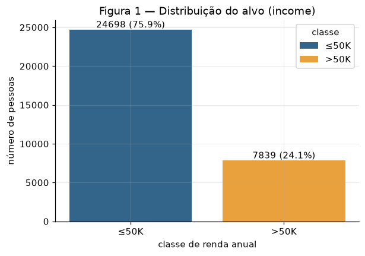

São **7839 `>50K` (24.09%)** contra 24698 `≤50K`, uma razão de **3.15:1**. O
desbalanceamento é moderado, mas decide como a próxima entrega deve ser avaliada: um
classificador que responde sempre `≤50K` já acerta **75.91%**. Esse é o piso a superar, e
acurácia sozinha não serve como métrica.

### D — Train and test

Fizemos um split **80/20 estratificado pelo alvo**, com `random_state=42`. São **26029
linhas no treino e 6508 no teste**, ambos com exatamente 24.09% de `>50K`. A estratificação
garante essa proporção por construção. **Daqui em diante, toda análise e toda estatística de
pré-processamento usa só o treino**, para nenhuma decisão ser informada pelo teste.

## 2. Univariate analysis

### A — Numerical

| (treino) | média | mediana | desvio | mín | Q1 | Q3 | máx | assimetria |
|---|---|---|---|---|---|---|---|---|
| `age` | 38.55 | 37 | 13.65 | 17 | 28 | 47 | 90 | +0.56 |
| `education-num` | 10.09 | 10 | 2.57 | 1 | 9 | 12 | 16 | −0.31 |
| `hours-per-week` | 40.43 | 40 | 12.43 | 1 | 40 | 45 | 99 | +0.23 |
| `capital-gain` | 1064.60 | 0 | 7303.52 | 0 | 0 | 0 | 99999 | **+12.07** |
| `capital-loss` | 86.88 | 0 | 402.35 | 0 | 0 | 0 | 4356 | **+4.61** |

*Tabela 3 — estatísticas descritivas das numéricas (treino).*

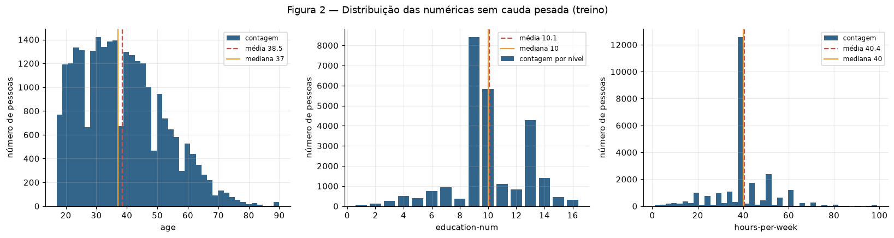

`age` tem cauda à direita (média 38.5 > mediana 37) e se distribui de forma contínua, com
um único acúmulo visível aos 90 anos, que é o teto do censo (1B). `education-num` é discreta e tem **três modas, que são os diplomas**: 9 = HS-grad
(32.3%), 10 = Some-college (22.4%) e 13 = Bachelors (16.4%). `hours-per-week` tem um pico
enorme em **40 horas (46.6% do treino)**, e por isso o Q1 e a mediana coincidem. Há picos
menores em números redondos (20, 50, 60): as pessoas arredondam as horas que declaram.
**Conclusão:** as três têm assimetria baixa (|assimetria| ≤ 0.56) e só precisam de escala,
não de transformação.

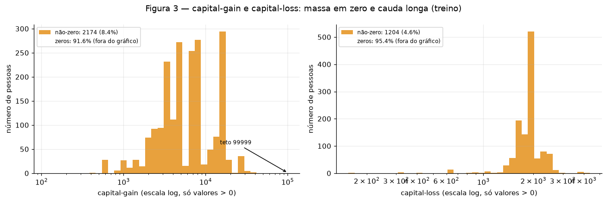

`capital-gain` é **zero em 91.6% do treino**. Quando não é zero, tem mediana de 7298 e
chega ao teto de 99999, onde estão 124 pessoas do treino. `capital-loss` é zero em 95.4%;
os valores não nulos têm mediana de 1887 e máximo de 4356. **Conclusão:** são
distribuições com massa em zero e cauda extrema (assimetria +12.07 e +4.61), e nenhuma
escala linear sozinha as torna utilizáveis por uma rede — é o argumento para o `log1p` em 4A.

### B — Categorical

| (treino) | níveis | faltantes | mais frequente | raras (< 1%) |
|---|---|---|---|---|
| `workclass` | 8 | 1479 (5.7%) | Private 69.5% | Without-pay 0.05%, Never-worked 0.02% |
| `marital-status` | 7 | 0 | Married-civ-spouse 45.9% | Married-AF-spouse 0.07% |
| `occupation` | 14 | 1484 (5.7%) | Prof-specialty 12.7% | Priv-house-serv 0.45%, Armed-Forces 0.03% |
| `relationship` | 6 | 0 | Husband 40.5% | — |
| `race` | 5 | 0 | White 85.6% | Amer-Indian-Eskimo 0.94%, Other 0.79% |
| `sex` | 2 | 0 | Male 66.8% | — |
| `native-country` | **41** | 455 (1.7%) | United-States 89.7% | **39 países, 1729 linhas** |

*Tabela 4 — frequência e cardinalidade das categóricas (treino).*

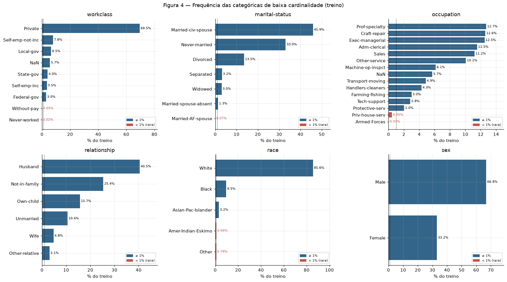

**Conclusão:** só `occupation` é bem distribuída (a categoria mais frequente tem 12.7%). As
outras são dominadas por uma categoria — Private 69.5%, White 85.6%, Male 66.8% — e
**quatro das seis** têm categorias raras, algumas com menos de 0.1% do treino. O one-hot
precisa de uma política para elas.

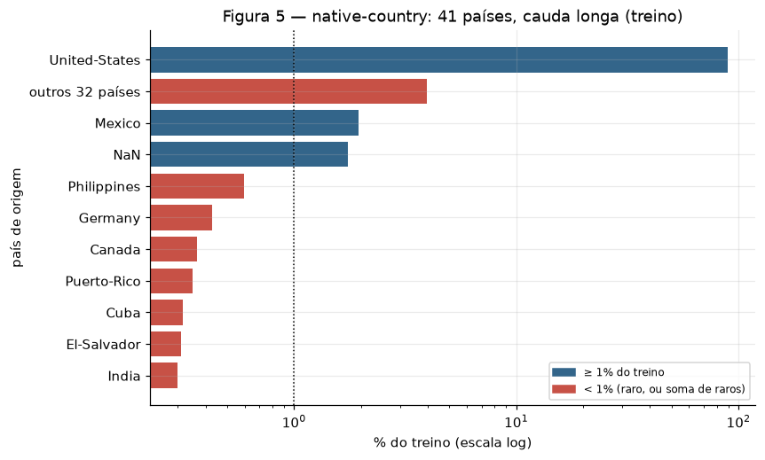

**Conclusão:** `native-country` é, na prática, "Estados Unidos contra o resto". São 41
países, mas **39 deles têm menos de 1% cada**: um one-hot direto criaria 39 colunas quase
vazias, com poucas dezenas de exemplos cada. É o caso de alta cardinalidade do dataset.

## 3. Bivariate and multivariate analysis

### A — Numerical × numerical

Usamos **Spearman**, não Pearson, porque `capital-gain` e `capital-loss` têm massa em zero e
assimetria de +12 e +4.6, e `education-num` é ordinal. Pearson assume relação linear e é
sensível aos extremos; Spearman trabalha com postos e capta qualquer relação monotônica. A
diferença aparece nos dados: em `age × hours-per-week`, Pearson dá **+0.069** e Spearman
dá **+0.145**.

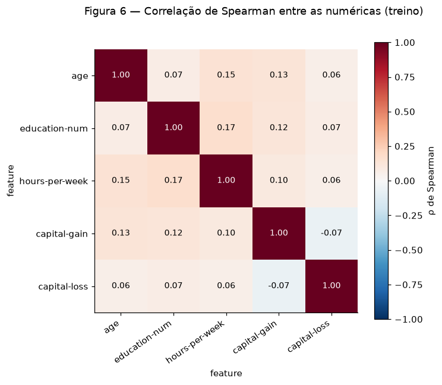

**Conclusão:** **nenhum par passa de |0.17|**. O mais correlacionado é
`education-num × hours-per-week`, com ρ = **+0.168**. Não há par numérico redundante, então
mantemos as cinco. As redundâncias do dataset atravessam tipos (`education` ↔
`education-num`, `relationship` ↔ `sex`, vistas em 1B). O único ρ negativo,
`capital-gain × capital-loss` = −0.066, vem de as duas nunca serem positivas ao mesmo tempo.

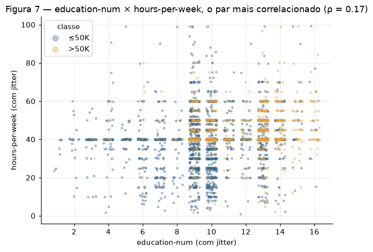

**Conclusão:** mesmo o par mais correlacionado quase não se relaciona (ρ = 0.17). Mas os
pontos `>50K` se concentram em `education-num ≥ 13` e `hours-per-week ≥ 40`: as duas
features importam para o alvo, cada uma por conta própria, e não uma por meio da outra.

### B — Categorical × target

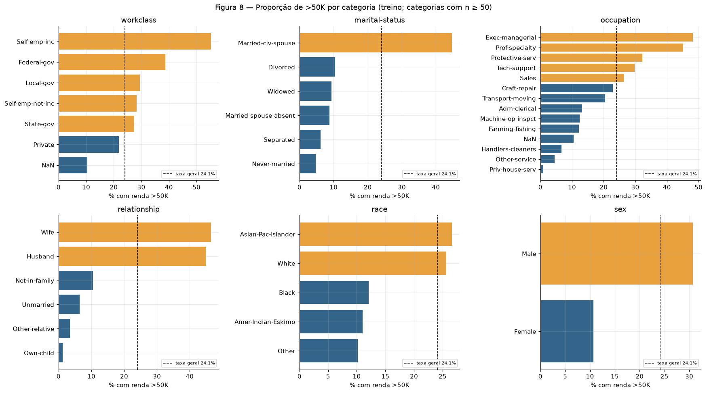

A taxa geral de `>50K` no treino é 24.09%. Os maiores contrastes, considerando só
categorias com pelo menos 50 pessoas, são:

- **`relationship`:** Wife 46.5% e Husband 45.0%, contra Own-child **1.3%**.
- **`occupation`:** Exec-managerial 48.2% e Prof-specialty 45.1%, contra Priv-house-serv **0.9%**.
- **`marital-status`:** Married-civ-spouse 44.7%, contra Never-married **4.7%**.
- **`workclass`:** Self-emp-inc 55.3%, contra os faltantes (`NaN`) com **10.5%**.
- **`sex`:** Male 30.7% contra Female 10.7%.
- **`race`:** de 26.6% (Asian-Pac-Islander) a 10.2% (Other).

**Conclusão:** as variáveis de **família e ocupação** separam o alvo muito mais do que raça e
sexo. Ser casado multiplica por 9.5 a taxa de `>50K` em relação a nunca ter casado (44.7%
contra 4.7%). Os faltantes de `workclass` e `occupation` (10.5% e 10.4%) ficam bem abaixo da
taxa geral, o que confirma, agora no treino, que a ausência é informativa.

### C — Numerical × categorical

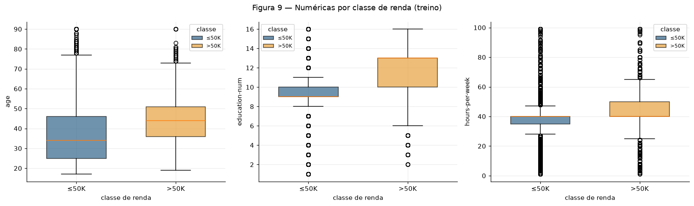

| (treino) | `≤50K`: mediana [Q1–Q3] | `>50K`: mediana [Q1–Q3] | posição | dispersão |
|---|---|---|---|---|
| `age` | 34 [25–46], IQR 21 | 44 [36–51], IQR 15 | +10 anos | menor em `>50K` |
| `education-num` | 9 [9–10], IQR 1 | 13 [10–13], IQR 3 | +4 níveis | maior em `>50K` |
| `hours-per-week` | 40 [35–40], IQR 5 | 40 [40–50], IQR 10 | caixa sobe 5–10 h | dobra em `>50K` |

**Conclusão:** nas três numéricas os grupos diferem **em posição e em dispersão**. Quem ganha
`>50K` é mais velho, mais escolarizado e trabalha mais. Em idade, esse grupo também é mais
homogêneo (IQR 15 contra 21); em escolaridade e horas, mais disperso.

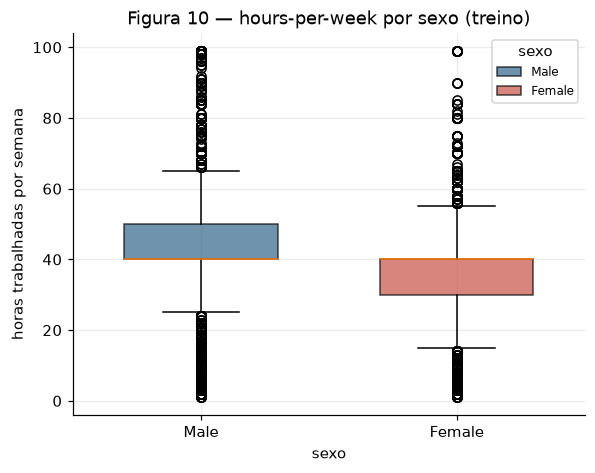

**Conclusão:** aqui os grupos diferem **só em posição**. A dispersão é a mesma (IQR 10 nos
dois sexos, desvios de 12.17 e 11.92), mas a caixa dos homens fica entre 40 e 50 horas e a
das mulheres entre 30 e 40. **A mediana sozinha esconderia a diferença:** ela é 40 nos dois
grupos, por causa do pico do tempo integral.

??? example "Código das etapas 1 a 3 (e das evidências das etapas 4A e 4C) — `eda.py`"

    ``` { .python .copy linenums="1" title="docs/projects/eda/code/eda.py" }
    --8<-- "docs/projects/eda/code/eda.py"
    ```

## 4. Preprocessing

### A — Strategies

Cada estratégia foi ajustada **só no treino**, e cada uma aponta o achado que a motiva. O
destino é uma **rede neural**, treinada por gradiente.

**Valores faltantes.**

- **Categóricas:** o faltante vira a **categoria própria `"Unknown"`**, e não a moda. A
  ausência em `workclass`/`occupation` tem só **10.48%** de `>50K` no treino, contra 24.09%
  (1B, Figura 8). Preencher com a moda (`Private`) apagaria esse sinal e ainda contaminaria a
  categoria: a taxa de `>50K` de `Private` cairia de 21.90% para 21.03%, porque ela passaria
  a misturar duas populações diferentes. Em `native-country` a ausência não é informativa
  (25.49%, igual à geral), mas `"Unknown"` também não prejudica, e evita empurrar mais 1.7%
  das linhas para United-States, que já tem 89.7%.
- **Numéricas:** não há faltantes. Um imputador pela **mediana** fica no pipeline como
  defesa — mediana porque as numéricas têm cauda (Tabela 3).

**Outliers.** Nenhuma linha é removida. `capital-gain` e `capital-loss` recebem **`log1p`**.

- A regra clássica do IQR **não serve aqui.** Em `capital-gain`, Q1 = Q3 = 0, então a regra
  marca como outlier **toda pessoa com ganho de capital**: 2174 linhas (8.4% do treino), com
  61.3% de `>50K`. Elas contêm **1333 dos 6271 positivos do treino (21.3%)**. Remover esses
  "outliers" apagaria um quinto da classe minoritária, justamente o grupo com mais sinal.
- Os extremos são **teto do censo**, não erros (1B). O `log1p` leva o máximo de
  `capital-gain` de **13.5 para 4.4 desvios** acima da média (`capital-loss`: de 10.6 para
  5.1), mantém o zero no zero e preserva a ordem.
- **Linhas afetadas: 3378 (13.0% do treino)**, as que têm ganho ou perda de capital.
  `age = 90` e `hours-per-week = 99` ficam como estão: são plausíveis e a assimetria dessas
  colunas é baixa.

**Encoding.** As 7 categóricas nominais recebem **one-hot completo**, sem `drop="first"`.

- A rede precisa de entrada numérica, e essas categorias não têm ordem.
- Não descartamos a primeira categoria. Com `drop="first"`, a categoria descartada vira a
  origem (todas as colunas do bloco em zero): ela fica à distância **1** de cada uma das
  outras, enquanto as outras ficam a **√2 ≈ 1.41** entre si. É uma proximidade inventada,
  que distorce os métodos baseados em distância (4B). Com o one-hot completo, todas as
  categorias ficam equidistantes, e uma rede com viés não precisa desse descarte.
- **Categorias raras** (menos de 1% do treino) vão para um balde **`infrequent`**
  (`min_frequency=0.01`). As 39 categorias raras de `native-country` (Figura 5) viram uma
  coluna só; o mesmo acontece com as raras de `workclass`, `marital-status`, `occupation` e
  `race` (Tabela 4).
- **Categoria nova no teste:** `handle_unknown="infrequent_if_exist"` a manda para o balde
  `infrequent` da feature. Testamos com `occupation = "Astronaut"`, que ativou
  `cat__occupation_infrequent_sklearn`. Em features sem balde (`relationship`, `sex`), a
  categoria nova vira um vetor todo-zeros. Neste split, nenhuma categoria do teste está
  ausente do treino, mas o pipeline está protegido para quando estiver.

**Escala.** As 5 numéricas são **padronizadas** (média 0, desvio 1), depois do `log1p` nas
de capital.

- As escalas originais vão de 1–16 (`education-num`) a 0–99999 (`capital-gain`) (Tabela 3).
  Sem escala, `capital-gain` dominaria as somas ponderadas e os gradientes da rede.
- Escolhemos padronização, e não normalização min-max, porque os valores no teto que
  mantivemos (90 anos, 99 horas) ditariam o min-max e comprimiriam o miolo dos dados numa
  faixa estreita.
- As colunas one-hot continuam 0/1.

### B — Dimensionality reduction

As três projeções usam as features de treino **já transformadas** pelo pipeline (50
colunas), coloridas pelo alvo.

**PCA** (treino inteiro):

- Das 50 colunas, **7 têm autovalor zero**. É exatamente uma por bloco one-hot: as colunas de
  cada categórica somam 1 em toda linha, o que cria uma dependência linear exata por bloco.
  Restam 43 direções reais.
- **PC1 = 18.05%, PC2 = 12.32%, PC1 + PC2 = 30.37%.** São precisos 10 componentes para 80% da
  variância e 18 para 90%: os dados não vivem num plano.
- **Loadings da PC1:** `age` +0.499, `hours-per-week` +0.461, `capital-gain` +0.359,
  `education-num` +0.354, `Husband` +0.242, `Married-civ-spouse` +0.239 e `Never-married`
  −0.222. A PC1 é um eixo de **"adulto estabelecido"**: mais velho, mais escolarizado, mais
  horas, casado e com ganho de capital. São exatamente os atributos que 3B e 3C associaram a
  `>50K`.
- **Loadings da PC2:** dominada por `capital-loss` (+0.548) e `education-num` (+0.539),
  contra `age` (−0.470).

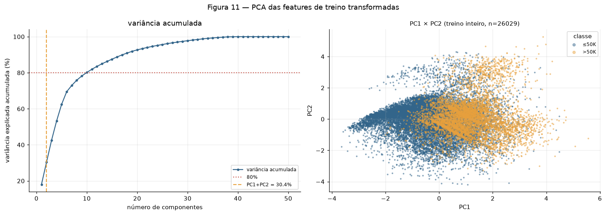

Na Figura 11, `>50K` se concentra na PC1 positiva, mas sobre um contínuo: não há fronteira,
só um gradiente.

**t-SNE e UMAP** usam uma amostra estratificada de **3000 pontos do treino** (24.10% de
`>50K`). O enunciado autoriza amostrar em datasets grandes, e a amostra é a mesma para os
dois métodos. Cada um rodou com dois valores de parâmetro: perplexidade 30 e 50 no t-SNE,
`n_neighbors` 15 e 50 no UMAP.

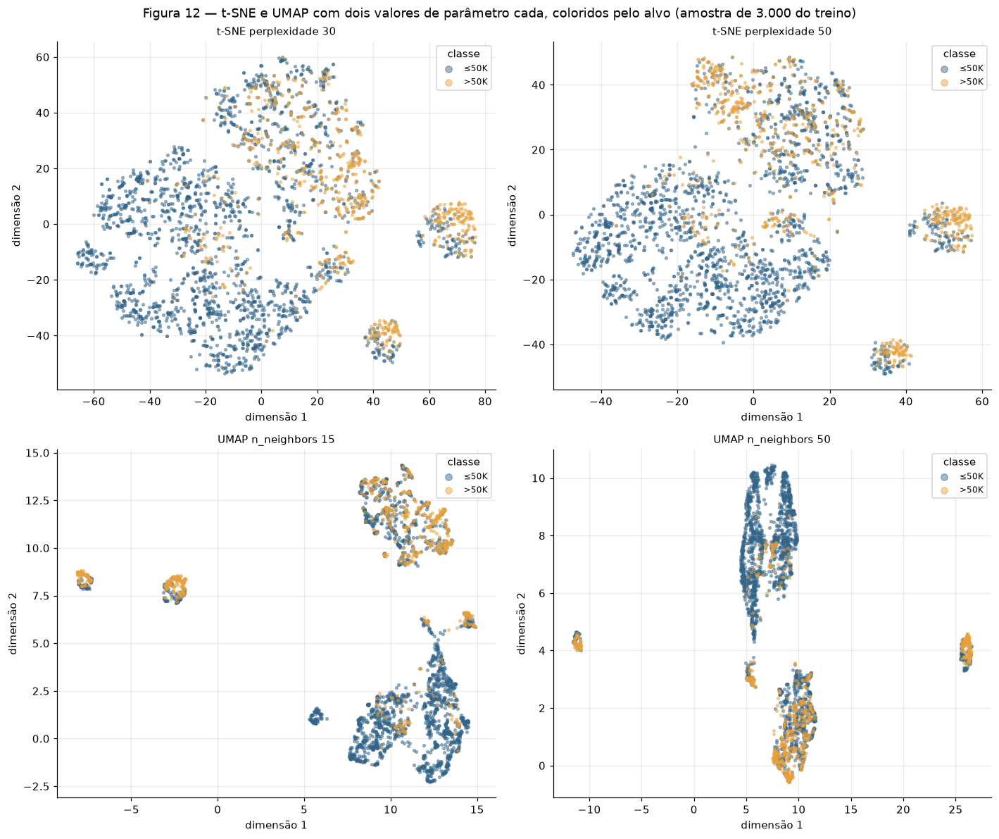

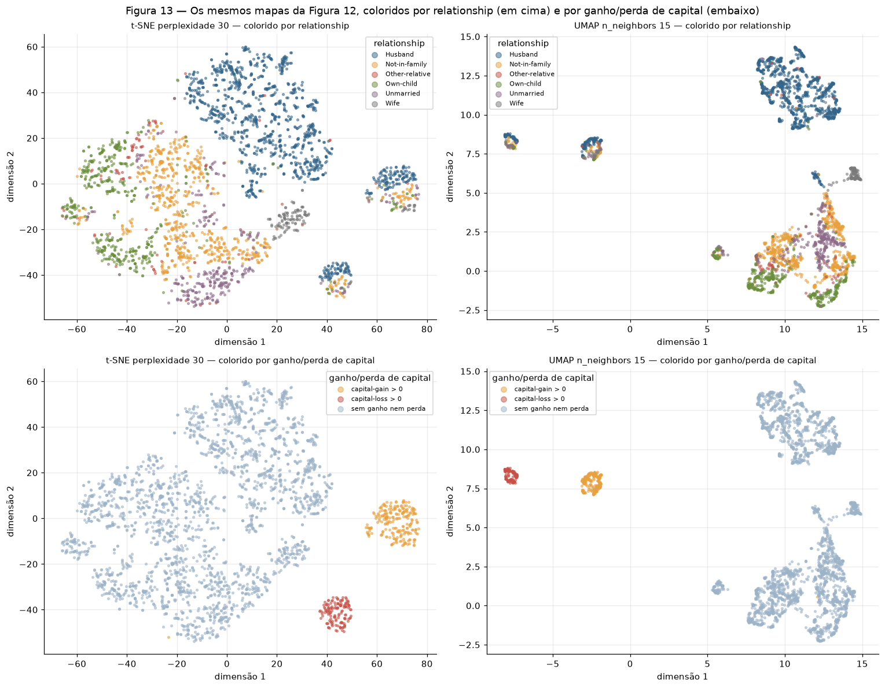

| mapa (amostra de 3000) | confiab. k=10 | confiab. k=50 | silhueta: income | silhueta: relationship | silhueta: capital |
|---|---|---|---|---|---|
| PCA | 0.809 | 0.808 | 0.197 | −0.008 | 0.274 |
| t-SNE perplexidade 30 | **0.983** | 0.947 | 0.147 | 0.095 | 0.298 |
| t-SNE perplexidade 50 | 0.982 | 0.952 | 0.136 | 0.102 | 0.356 |
| UMAP n_neighbors 15 | 0.968 | 0.939 | 0.199 | **0.140** | 0.569 |
| UMAP n_neighbors 50 | 0.963 | 0.948 | **0.253** | 0.115 | **0.748** |
| espaço original (50 dim.) | — | — | 0.092 | 0.100 | 0.310 |

*Tabela 5 — confiabilidade (*trustworthiness*, preservação de vizinhanças) e silhueta por
três rotulagens diferentes.*

**O que os mapas não lineares mostram e o PCA não mostra.**

- **Estrutura discreta.** Onde o PCA vê um contínuo, t-SNE e UMAP mostram regiões e ilhas
  bem separadas. A Figura 13 explica as duas camadas dessa estrutura. As **regiões grandes
  se organizam por `relationship`**: Husband ocupa uma região, Not-in-family, Own-child e
  Unmarried ocupam outras, e Wife forma uma ilha própria. Já as **ilhas pequenas e
  destacadas reúnem as pessoas com ganho ou com perda de capital** — na amostra, 229 pessoas com `capital-gain > 0` (58.5% de `>50K`) e 139 com `capital-loss > 0` (55.4%), contra 19.5% das 2632 sem nenhum dos dois. Como as duas condições nunca aparecem na mesma pessoa (1B), elas formam **duas** ilhas, uma para cada. O `log1p` com padronização deixa 91.6% das pessoas no mesmo valor (zero) e afasta as demais vários desvios dele. Os métodos não lineares transformam esse salto numa ilha separada. A Tabela 5 confirma: a silhueta por esse agrupamento é a **maior de todas as rotulagens** — 0.748 no UMAP com `n_neighbors` 50 e 0.569 com 15, contra no máximo 0.253 pela renda.
- **O que forma as ilhas são as features, não a renda.** Os dados são uma união de
  subpopulações definidas pelas categorias do one-hot e pelos dois "degraus" do capital
  (zero ou não). A renda varia *dentro* dessas regiões.
- **Vizinhança local × estrutura global.** t-SNE e UMAP preservam vizinhanças locais bem
  melhor (confiabilidade de 0.96 a 0.98, contra 0.81 do PCA), mas perdem precisão quando a
  vizinhança aumenta de k=10 para k=50. O PCA fica estável (0.809 → 0.808): ele preserva a
  estrutura ampla e sacrifica a local.
- **Nenhum dos três separa a renda.** As silhuetas pelo alvo são baixas (0.14 a 0.25),
  coerente com o piso de 75.91% e com a sobreposição vista em 3C. O maior valor, 0.253 no
  UMAP com `n_neighbors` 50, não indica um mapa melhor: vizinhanças maiores compactam os
  grupos e elevam a silhueta por construção.

**Controle.** Embaralhamos cada coluna da amostra de forma independente, o que destrói a
estrutura conjunta, e rodamos o t-SNE com perplexidade 30. A silhueta pela renda caiu de
**0.147 para −0.013**: a estrutura de renda que o t-SNE mostra é real, não artefato do
algoritmo. Mas a confiabilidade nos dados embaralhados continuou alta (**0.945**). Ou seja,
o t-SNE preserva com fidelidade até as vizinhanças do ruído — **confiabilidade alta sozinha
não certifica que o mapa mostra algo com significado.**

**Leitura correta dos mapas.** Em t-SNE e UMAP, o tamanho dos clusters e a distância entre
eles não têm leitura direta: as ilhas de capital parecem "longe", mas essa distância não
mede nada. E só PCA e UMAP projetam dados novos (`.transform`); o t-SNE não. Ele serve para
explorar, não para entrar no pipeline.

??? example "Código da etapa 4B — `dimred.py`"

    ``` { .python .copy linenums="1" title="docs/projects/eda/code/dimred.py" }
    --8<-- "docs/projects/eda/code/dimred.py"
    ```

### C — Pipeline

O pipeline está em [`code/pipeline.py`](https://github.com/Lagoass/ann-dl/blob/main/docs/projects/eda/code/pipeline.py){:target='_blank'},
um arquivo **importável** (`from pipeline import load_clean, split, build_preprocessor`):
`Pipeline` + `ColumnTransformer`, ajustado só no treino. Os dois scripts acima o importam,
e a próxima entrega vai importar o mesmo arquivo.

``` { .python .copy linenums="1" title="docs/projects/eda/code/pipeline.py" }
--8<-- "docs/projects/eda/code/pipeline.py"
```

**Verificações** (saída de `eda.py`):

- **Nenhum `NaN`**, nem no treino nem no teste.
- **`shape`:** treino **(26029, 50)** e teste **(6508, 50)**.
- **As 50 features:** 5 numéricas (`num__age`, `num__education-num`, `num__hours-per-week`,
  `num_log__capital-gain`, `num_log__capital-loss`) e 45 one-hot — `workclass` (8, incluindo
  `Unknown` e `infrequent`), `marital-status` (7), `occupation` (15), `relationship` (6),
  `race` (4), `sex` (2) e `native-country` (4: Mexico, United-States, `Unknown` e
  `infrequent`).
- **Prova de que nada vazou:** a média das numéricas transformadas é **exatamente 0 no
  treino**, mas **não no teste** ([0.013, −0.007, 0.006, −0.001, 0.009]). Se o escalonador
  tivesse visto o teste, a média lá também seria 0.
- As medianas aprendidas no treino são `age` 37, `education-num` 10 e `hours-per-week` 40.

## 5. Synthesis

### Principais achados

1. **Desbalanceamento moderado:** 24.09% de `>50K`, então o piso trivial é 75.91% de
   acurácia (Figura 1).
2. **A ausência é informativa** em `workclass` e `occupation` (10.48% de `>50K` contra
   24.09%), e por isso vira a categoria `"Unknown"` (1B, Figura 8, 4A).
3. **`capital-gain` tem massa em zero, teto em 99999 e relação quase mecânica com o alvo:**
   acima de 7000, 98.6% são `>50K` (Figura 3, 1B).
4. **A regra do IQR seria destrutiva:** removeria 21.3% da classe positiva. Usamos `log1p`
   e não removemos nenhuma linha (4A).
5. **As redundâncias atravessam tipos:** `education` ↔ `education-num` (descartada) e
   `relationship` ↔ `sex` (mantida e sinalizada) (1B). As numéricas entre si quase não se
   correlacionam (ρ ≤ 0.168, Figura 6).
6. **Família e ocupação explicam mais do que demografia:** casados têm 44.7% de `>50K`,
   contra 4.7% de quem nunca casou (Figura 8). Idade, escolaridade e horas diferem em
   posição e em dispersão entre as classes (Figura 9).
7. **A estrutura é discreta e não separa a renda:** regiões por `relationship` e ilhas de
   capital, com silhueta pelo alvo de no máximo 0.25 (Figuras 12 e 13, Tabela 5).

### Riscos para a modelagem e plano de tratamento

| Risco | Evidência | Plano para a entrega de Classificação |
|---|---|---|
| Desbalanceamento | 24.09% de positivos; piso de 75.91% | Medir F1, ROC-AUC e recall de `>50K`, não só acurácia; peso de classe na função de perda; validação estratificada |
| Vazamento parcial por `capital-gain` | ≥ 7000 → 98.6% `>50K`; teto → 100% | Treinar **com e sem** as features de capital e comparar; reportar o desempenho no subconjunto sem ganho de capital |
| Subconjunto trivial | as 159 pessoas no teto são 100% `>50K` | Separar o erro nesse grupo do erro no resto, para a acurácia não ser inflada |
| Atributos sensíveis | `sex` (30.7% contra 10.7%) e `race`, mais `relationship`, que codifica o sexo | Reportar métricas por sexo e por raça; fazer uma ablação sem esses atributos |
| Categorias raras | 39 países com menos de 1% | Balde `infrequent`; acompanhar o erro nesse grupo |
| Sobreajuste | 50 features one-hot, 26 mil linhas | Validação com *early stopping*; regularização (L2, dropout) |

## Results summary

| # | Results summary | Value |
|---|---|---|
| 1 | Dataset, task and target | Adult Income (UCI, Censo dos EUA de 1994) · classificação binária · `income` (`>50K` vs `≤50K`) |
| 2 | Instances × features (numerical / categorical) | 32561 × 14 (6 / 8) no arquivo; 32537 × 12 (5 / 7) após a limpeza |
| 3 | Column with the most missing values and its percentage | `occupation` — 1843 faltantes (5.66%) |
| 4 | Dropped columns and the reason | `education` (bijeção com `education-num`) e `fnlwgt` (peso amostral, ρ = −0.011 com o alvo); mais 24 linhas duplicadas |
| 5 | Minority class (%) · or mean and median of the target | `>50K` = **24.09%** (7839 de 32537) |
| 6 | Size of the training and test sets | **26029** (treino) e **6508** (teste) — 80/20 estratificado |
| 7 | Most correlated numerical pair and its value | `education-num × hours-per-week`, ρ de Spearman = **+0.168** |
| 8 | Rows affected by the outlier strategy | **3378** linhas do treino (13.0%) transformadas por `log1p`; **0** removidas |
| 9 | Variance explained by PC1 + PC2 | **30.37%** (18.05% + 12.32%) |
| 10 | shape of train and test after the pipeline | **(26029, 50)** e **(6508, 50)** |
