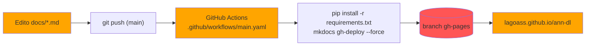
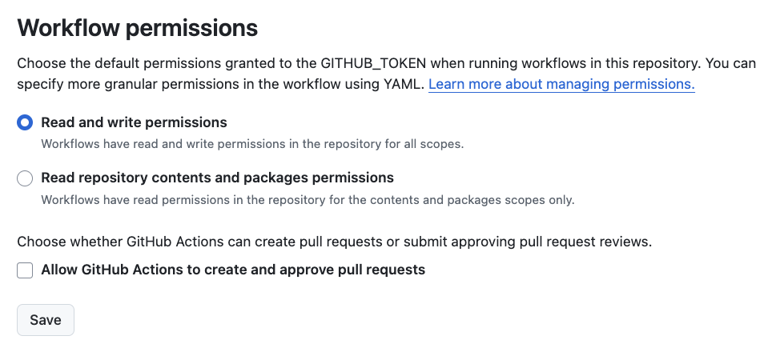

# Sobre este site

Este site é gerado com [MkDocs](https://www.mkdocs.org/){:target="_blank"} + tema
[Material for MkDocs](https://squidfunk.github.io/mkdocs-material/){:target="_blank"},
a partir do [template de entrega](https://github.com/hsandmann/documentation.template){:target="_blank"}
da disciplina. O conteúdo fica em `docs/` (Markdown) e a publicação no GitHub Pages é
automática via GitHub Actions.



## Rodando localmente

Pré-requisitos: **Git** e **Python 3.12+**.

=== "Windows (PowerShell)"

    ``` powershell
    python -m venv .venv
    .\.venv\Scripts\Activate.ps1
    python -m pip install -r requirements.txt --upgrade
    mkdocs serve -o
    ```

=== "Linux / macOS"

    ``` shell
    python3 -m venv .venv
    source ./.venv/bin/activate
    python3 -m pip install -r requirements.txt --upgrade
    mkdocs serve -o
    ```

O `mkdocs serve` sobe um servidor em <http://127.0.0.1:8000> com *live reload*. Para
checar se não há links quebrados ou páginas fora do `nav` antes de publicar:

``` shell
mkdocs build --strict
```

## Publicação

Não é preciso rodar `mkdocs gh-deploy` na mão: o workflow em
`.github/workflows/main.yaml` roda esse comando a cada `push` na branch `main`, e ele
publica o site estático na branch `gh-pages`.

``` { .yaml .copy .select linenums='1' title=".github/workflows/main.yaml" }
--8<-- ".github/workflows/main.yaml"
```

!!! warning "Se a página não subir"

    1. **Permissão do Actions** — o workflow já declara `permissions: contents: write`,
       mas se ainda assim o deploy falhar com `403`, vá em *Settings → Actions → General
       → Workflow permissions* e marque **Read and write permissions**.

        

    2. **Fonte do Pages** — em *Settings → Pages*, a fonte precisa ser
       **Deploy from a branch → `gh-pages` / `(root)`**.

        

!!! danger "Ao renomear o repositório"

    `site_url` e `repo_url` no `mkdocs.yml` precisam apontar para o repositório correto,
    senão os links canônicos e o botão do GitHub quebram:

    ``` yaml
    site_url: https://lagoass.github.io/ann-dl
    repo_url: https://github.com/Lagoass/ann-dl
    ```

## Cheat sheet de Markdown

### Diagramas com Mermaid

Use o [Mermaid](https://mermaid.js.org/intro/){:target='_blank'}
([editor online](https://mermaid.live/){:target='_blank'}) dentro de uma cerca
` ```mermaid `.

### Código

=== "De um arquivo remoto"

    ``` { .yaml .copy .select linenums='1' title="requirements.txt" }
    --8<-- "requirements.txt"
    ```

=== "Anotações no código"

    ``` { .python title="exemplo.py" }
    import numpy as np

    rng = np.random.default_rng(42)  # (1)!
    X = rng.normal(loc=0.0, scale=1.0, size=(1000, 5))  # (2)!
    ```

    1. Seed fixa — exigência do enunciado para que os resultados sejam reprodutíveis.
    2. 1.000 amostras × 5 features.

### Matemática

Fórmulas em LaTeX via MathJax: $\tanh(z) = \dfrac{e^{z} - e^{-z}}{e^{z} + e^{-z}}$

$$
\sigma(z) = \frac{1}{1 + e^{-z}}
$$

### Notebooks Jupyter

Basta colocar o `.ipynb` dentro de `docs/` e referenciá-lo no `nav` do `mkdocs.yml` — o
plugin [mkdocs-jupyter](https://github.com/danielfrg/mkdocs-jupyter){:target="_blank"}
renderiza o notebook (com `execute: false`, ou seja, mostra as saídas já salvas).

## Referências

- [Material for MkDocs — Reference](https://squidfunk.github.io/mkdocs-material/reference/){:target='_blank'}
- [PyMdown Extensions](https://facelessuser.github.io/pymdown-extensions/){:target='_blank'}
